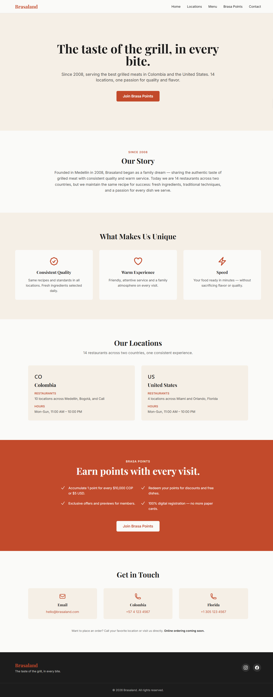
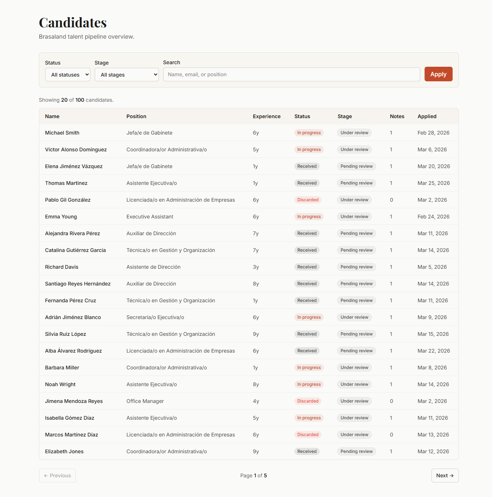
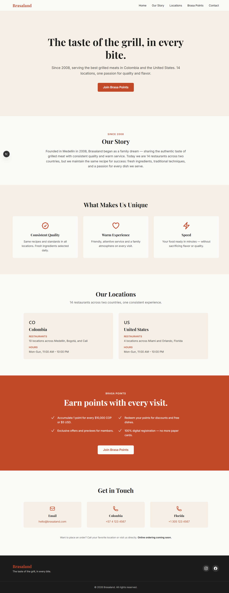
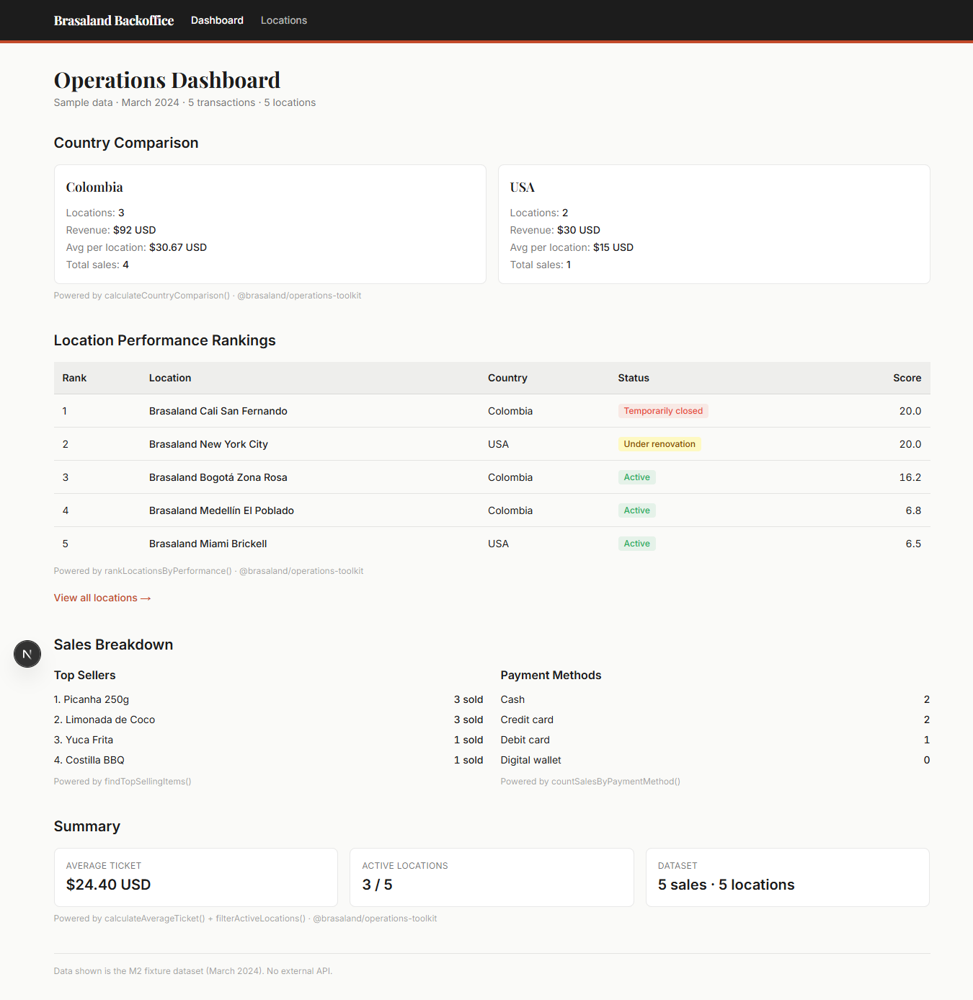

# brasaland-digital


The digital platform for Brasaland, a 14-location grilled-food restaurant chain across Colombia and the United States.

Brasaland Digital is an npm + Python monorepo: five npm workspaces under `apps/` and `uis/` (public marketing site, operations toolkit, talent pipeline tracker, Next.js website rebuild, and operations backoffice), plus Python packages under `packages/` and FastAPI services under `services/` (auth, inventory, incident-manager, supplier-directory, incident-analysis, telemetry) and an additional Next.js UI (`uis/incident-manager`). Shared tooling and conventions without forcing shared runtime dependencies.

## Live demos

### M1 — Brasaland public website
**Live:** https://brasaland-public-website.vercel.app



---

### M3 — Talent Pipeline Tracker
**Live:** https://brasaland-talent-pipeline.vercel.app



---

### M4 — Website (Next.js rebuild)
**Live:** https://brasaland-website.vercel.app



---

### M4 — Backoffice (Operations Dashboard)
**Live:** https://brasaland-backoffice.vercel.app



## Workspaces

| Workspace | Role | Stack | Status |
| --- | --- | --- | --- |
| `@brasaland/public-website` | Customer-facing marketing site and Brasa Points sign-up | HTML5, Tailwind CSS (CDN), vanilla JavaScript | Complete |
| `@brasaland/operations-toolkit` | Pure TypeScript utility library for restaurant operations data | TypeScript, Vitest | Complete |
| `@brasaland/talent-pipeline-tracker` | Internal HR app for managing candidate pipelines | Next.js (App Router), React, Tailwind CSS | Complete |
| `@brasaland/website` | Next.js rebuild of the public website | Next.js 16, React 19, Tailwind v4, TypeScript | Live |
| `@brasaland/backoffice` | Internal operations dashboard with M2 integration | Next.js 16, React 19, Tailwind v4, TypeScript | Live |

## Repository structure

```
brasaland-digital/
├── apps/
│   ├── public-website/          # M1 — landing page + Brasa Points form (live)
│   ├── operations-toolkit/      # M2 — pure TypeScript library (no UI)
│   └── talent-pipeline-tracker/ # M3 — Next.js HR app (live)
├── uis/
│   ├── website/                 # M4 — Next.js rebuild of public website (port 3002)
│   ├── backoffice/              # M4 — Operations dashboard with M2 integration (port 3003)
│   └── incident-manager/        # Incident manager UI (port 3004)
├── packages/
│   ├── shared/                  # Shared Python core (brasaland_shared — validation, lifecycle)
│   └── auth-verify/             # Verify-only RS256 JWT package (brasaland_auth_verify)
├── services/
│   ├── auth/                    # Python JWT authentication service (FastAPI, TinyDB)
│   ├── supplier-directory/      # Python supplier directory (FastAPI, TinyDB, web UI)
│   ├── incident-analysis/       # Python incident-analysis utility (CLI, FastAPI, web UI)
│   ├── incident-manager/        # Centralized incident manager (FastAPI, PostgreSQL/SQLModel)
│   ├── inventory/               # Ingredient inventory API (FastAPI, PostgreSQL/SQLModel)
│   └── telemetry/               # Telemetry ingest + report API (FastAPI, PostgreSQL/SQLModel)
├── memory-bank/                 # Agent context files (projectbrief, techContext, progress)
├── .agents/                     # Agent rules and skills
├── docs/
│   ├── standards/               # Agent, coding, architecture, and project-context standards
│   ├── brand-tokens.md          # Shared visual identity — colors, typography, tokens
│   ├── screenshots/             # Live demo screenshots
│   └── telemetry/               # Phase 1 inventory telemetry plan + event schemas
├── AGENTS.md                    # Root agent rules
├── package.json                 # npm workspaces root
└── README.md
```

## Tech stack

- **Language:** TypeScript (strict mode with `noUncheckedIndexedAccess`, `exactOptionalPropertyTypes`)
- **Public website (M1):** HTML5, Tailwind CSS via CDN, vanilla JavaScript
- **Operations toolkit (M2):** Pure TypeScript, Vitest for testing
- **Talent tracker (M3, live):** Next.js (App Router), React, Tailwind CSS
- **Website rebuild + Backoffice (M4):** Next.js 16 (App Router), React 19, Tailwind v4 (CSS-first), TypeScript strict
- **Tooling:** npm workspaces, Prettier, EditorConfig
- **Deployment:** Vercel (separate projects per workspace)

## Getting started

**Prerequisites:** Node.js 20+, npm 10+

```bash
npm install
```

**Run the public website locally:**

```bash
npm run dev --workspace @brasaland/public-website
```

Serves at `http://localhost:3000`.

**Run operations-toolkit tests:**

```bash
npm run test --workspace @brasaland/operations-toolkit
```

**Run the M4 website rebuild locally (port 3002):**

```bash
npm run dev --workspace @brasaland/website
```

**Run the M4 backoffice dashboard locally (port 3003):**

```bash
npm run dev --workspace @brasaland/backoffice
```

## Local development with Docker

**Prerequisites:** Docker Desktop (Linux engine), a filled root `.env` (see below).

1. Copy the template and set real values (Supabase `DATABASE_URL`, JWT PEM keys, Resend key if using password reset):

   ```bash
   cp .env.example .env
   ```

2. Build and start backend containers (APIs, Redis, Celery worker, Flower, UI):

   ```bash
   docker compose up --build
   ```

   Services communicate over the named network `brasaland-dev` using Docker DNS names (`http://inventory:8012`, etc.). Your browser uses host-published ports on `localhost`.

| Service | URL |
| --- | --- |
| Auth API | http://localhost:8002 |
| Supplier directory | http://localhost:8001 |
| Incident analysis | http://localhost:8000 |
| Incident manager API | http://localhost:8011 |
| Inventory API | http://localhost:8012 |
| Telemetry API | http://localhost:8013 |
| Reporting API | http://localhost:8014 |
| Redis (Celery broker) | localhost:6379 |
| Flower (Celery monitor) | http://localhost:5555 |
| Website (Next.js) | http://localhost:3002 |
| Backoffice (Next.js) | http://localhost:3003 |
| Incident manager UI (Next.js) | http://localhost:3004 |

**Reporting Celery worker:** Compose service `reporting-worker` runs `celery -A celery_app.celery_app worker` using the reporting image. Start/stop independently:

```bash
docker compose up -d reporting-worker
docker compose stop reporting-worker
```

Set `REDIS_URL` in the root `.env` (see `.env.example`). Inside Compose use `redis://redis:6379/0`; on the host use `redis://localhost:6379/0`. Flower reads the same URL via `CELERY_BROKER_URL`.

The backoffice and incident-manager UIs proxy API calls through Next.js rewrites to backend service names inside the `ui` container; `NEXT_PUBLIC_*` URLs still point at same-origin localhost UI ports.

**Build context note:** Both backend and UI images use the repo root as Docker build context. Only the root [`.dockerignore`](.dockerignore) is effective; per-folder ignore files under `services/` or `uis/` are not read by Docker.

### Database security (RLS)

All five brasaland-m5 public tables (`ingredient`, `ingrediententry`, `ingredientexit`, `incident`, `telemetry_events`) have **Row-Level Security enabled with zero policies** — a deny-by-default posture on the PostgREST/anon Data API path, which nothing in this repo uses.

The FastAPI services (`services/inventory`, `services/incident-manager`) connect via `DATABASE_URL` as the table owner and bypass RLS. **FORCE ROW LEVEL SECURITY** is deliberately not set.

One-time enablement (or re-enablement after adding tables):

```bash
cd services/inventory
uv run --python 3.13 python ../../scripts/enable_rls.py
uv run --python 3.13 python ../../scripts/enable_rls.py --dry-run
```

**Future-table caveat:** `SQLModel.metadata.create_all` creates new tables with RLS **disabled**. Re-run `scripts/enable_rls.py` after adding any table. For `telemetry_events`, run `scripts/setup_telemetry_table.py` after the table exists to create production indexes (including GIN on `tags`).

## Nightly telemetry export (DEV-53)

Standalone script that exports the previous UTC day of `public.telemetry_events` to an ignored audit CSV, records orchestration state in `reporting.job_runs`, and triggers the weekly M6 KPI pipeline as a subprocess.

### Invocation

Authoritative form (from the repo root; uses the `data/` uv project):

```powershell
uv run --directory data --python 3.13 python ../scripts/nightly_export.py
```

`--directory data` shifts the working directory to `data/`, so `../scripts/nightly_export.py` resolves to the repo-root script.

Direct execution also works (the script bootstraps `data/` onto `sys.path`):

```powershell
python scripts/nightly_export.py
```

### Environment

| Variable | Purpose |
| --- | --- |
| `DATABASE_URL` | Shared brasaland-m5 Postgres URL (also loaded from `data/.env` then `services/inventory/.env`) |
| `TARGET_DATE` | Optional `YYYY-MM-DD` UTC day to export; default = previous UTC day |
| `STALE_LOCK_HOURS` | Hours before a `processing` `job_runs` row is treated as orphaned (default `6`) |

### Two-layer run state

| Table | Role |
| --- | --- |
| `reporting.job_runs` | Nightly wrapper: one row per `(job_name, target_date)` with atomic claim, skip-duplicate, and stale-lock takeover |
| `reporting.pipeline_runs` | M6 internal weekly ETL history: one new row per child pipeline invocation |

The CSV under `data/raw/telemetry_YYYY-MM-DD.csv` is an **audit snapshot only**. The M6 pipeline always rereads PostgreSQL; it is not wired to the CSV.

### Daily target → weekly pipeline

Each run maps `target_date` to its containing ISO Monday (`week_start`) and invokes:

```text
uv run --directory data --python 3.13 python -m pipelines.run_weekly --week-start <monday>
```

Tuesday–Sunday re-runs for the same week are safe: KPI rows upsert on `(location_id, week_start)`; each child run appends a new `pipeline_runs` history row.

### Reporting schema RLS rollout (operator)

1. `uv run --python 3.13 python scripts/setup_reporting_schema.py --dry-run` then real (creates `reporting` schema; RLS skipped until tables exist).
2. Create tables via reporting `ensure_schema` and/or the first `job_runner.ensure_schema()` call (lazy safety net for cron-only hosts).
3. Setup dry-run then real again so RLS is enabled on `weekly_location_performance`, `pipeline_runs`, and `job_runs`.
4. Verify all three reporting tables have RLS enabled with zero policies.

### Schedule

UTC cron (preferred over a Compose scheduler container — this repo has no deployed scheduler pattern):

```cron
CRON_TZ=UTC
15 0 * * * cd /absolute/path/to/brasaland-digital && /absolute/path/to/uv run --directory data --python 3.13 python ../scripts/nightly_export.py
```

### Windows Task Scheduler (local dev)

1. Create a daily task for 00:15 **UTC** (convert to local time on the host, or run the host clock in UTC).
2. Action: start the **absolute** `uv.exe` path (same requirement as the script’s `shutil.which("uv")` check — a bare `uv` on PATH is not enough for a reliable scheduled action).
3. Arguments: `run --directory data --python 3.13 python ../scripts/nightly_export.py`
4. Start in: absolute path to the repo root.
5. Ensure `DATABASE_URL` is available to the task (system/user env or a wrapper that loads `data/.env`).

### Recovery runbook

| Situation | Behavior |
| --- | --- |
| Duplicate (`status=completed`) | INFO skip; exit 0; no CSV rewrite; no subprocess |
| Fresh `processing` lock | INFO skip; exit 0 |
| Stale `processing` (> `STALE_LOCK_HOURS`) | Mark failed (`stale lock takeover`), reclaim, continue |
| Prior `failed` | Guarded retry transition to `processing` |
| `uv` missing on PATH | ERROR; mark job failed; non-zero exit |
| Child pipeline non-zero | Mark failed with stderr tail; non-zero exit |
| Inspect state | Query `reporting.job_runs` for `job_name='nightly_export'` |

## Engineering decisions

**M2 is a standalone library, not inline code.** Business logic (filtering, ranking, financial
calculations) is isolated in `@brasaland/operations-toolkit` so it can be tested independently
of any UI framework. The backoffice imports it at runtime via npm workspace references — no code
is copied or duplicated.

**M4 uses React Server Components by default.** Every page and section component is a Server
Component unless interactivity explicitly requires `'use client'`. This keeps the client bundle
minimal and reflects how production Next.js applications are structured.

**TypeScript strictness is layered by workspace.** The backoffice adds `noUncheckedIndexedAccess`
and `exactOptionalPropertyTypes` on top of base strict mode — the same flags M2 enforces — because
it imports M2 types and must satisfy the same contracts.

**The operations toolkit ships TypeScript source, not compiled output.** It has no `dist/`
directory. Consumers resolve it through npm workspace symlinks directly to `src/index.ts`, which
works because all consuming workspaces use bundler-aware TypeScript resolution.

## Conventions

- Full standards live in [`docs/standards/`](docs/standards/) — start with [agent-workflow.md](docs/standards/agent-workflow.md) and [coding.md](docs/standards/coding.md)
- Commits follow the Conventional Commits specification with workspace scopes (e.g., `feat(public-website): ...`)
- Linear `main` history; no long-lived branches
- Code style enforced by Prettier (`printWidth: 100`, single quotes, semi)
- TypeScript strict flags on; no `any`, no `!` assertions, no `as` casts in production code

## Project status

| Milestone | Component | Status |
| --- | --- | --- |
| M1 public-website | Landing page (header, hero, story, features, locations, Brasa Points, contact, footer) | Complete |
| M1 public-website | Brasa Points registration form (4 fieldsets, 11 fields) | Complete |
| M1 public-website | Dependent dropdowns (Country → City → Favorite Location) | Complete |
| M1 public-website | Client-side form validation | Complete |
| M1 public-website | Mobile navigation (hamburger toggle, Escape-to-close) | Complete |
| M1 public-website | SVG favicon and social meta cleanup | Complete |
| M1 public-website | Vercel deployment | Live |
| M2 operations-toolkit | Domain types | Complete |
| M2 operations-toolkit | Collection utilities | Complete |
| M2 operations-toolkit | Search utilities | Complete |
| M2 operations-toolkit | Financial transformations | Complete |
| M2 operations-toolkit | Performance scoring | Complete |
| M2 operations-toolkit | Aggregation reports and country comparison | Complete |
| M2 operations-toolkit | Entity validation layer | Complete |
| M2 operations-toolkit | Test suite (115 tests, 4 test files) | Complete |
| M3 talent-pipeline-tracker | All components | Live |
| M4 uis/website | Next.js scaffold + M1 content migration | Complete |
| M4 uis/website | All 7 sections as React Server Components | Complete |
| M4 uis/website | Brasa Points form with TypeScript validators | Complete |
| M4 uis/website | Mobile navigation (hamburger, Escape-to-close) | Complete |
| M4 uis/website | Vercel deployment | Live |
| M4 uis/backoffice | Next.js scaffold | Complete |
| M4 uis/backoffice | M2 operations-toolkit integration | Complete |
| M4 uis/backoffice | Operations dashboard (4 sections, M2 fixture data) | Complete |
| M4 uis/backoffice | Vercel deployment | Live |
| M4 repo | Agent infrastructure (AGENTS.md, memory-bank/, .agents/) | Complete |

## License

All rights reserved.
