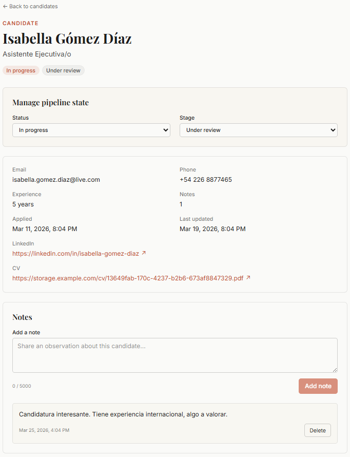

# @brasaland/talent-pipeline-tracker

Internal HR application for managing the Brasaland candidate pipeline.

## Overview

This workspace is Brasaland's internal talent pipeline tracker. HR staff use it to manage candidates through the full application lifecycle — from submission to final decision. The application consumes a mock REST API hosted at the 4Geeks Academy playground and is intended for internal use only, not customer-facing.

## Status

**Live demo:** https://brasaland-talent-pipeline.vercel.app


## Tech Stack

- Next.js 16 (App Router)
- TypeScript (strict mode)
- Tailwind CSS
- ESLint (Next.js config)

## Project Structure

```
apps/talent-pipeline-tracker/
├── app/
│   ├── layout.tsx       # Root layout with metadata
│   ├── page.tsx         # Home page
│   └── globals.css      # Global styles
├── public/
├── .env.example         # Environment variable template
├── next.config.ts       # Next.js configuration
├── tailwind.config.ts   # Tailwind configuration
├── tsconfig.json        # TypeScript configuration
├── package.json
└── README.md
```

## Scripts

| Script  | Command            | Description                           |
| ------- | ------------------ | ------------------------------------- |
| `dev`   | `next dev -p 3001` | Start development server on port 3001 |
| `build` | `next build`       | Build for production                  |
| `start` | `next start`       | Start production server               |
| `lint`  | `eslint`           | Run ESLint                            |

## Detail page

The candidate detail page surfaces the editable pipeline state, full candidate info, and the notes thread:



## Local Development

Install dependencies from the repo root, then run the dev server:

```bash
npm install
npm run dev --workspace @brasaland/talent-pipeline-tracker
```

The app is served at `http://localhost:3001`. Copy `.env.example` to `.env.local` and set `NEXT_PUBLIC_API_URL` before starting.

## Conventions

- App Router only — no `pages/` directory
- TypeScript strict mode; no `any`, no `!` assertions, no `as` casts in production code
- Component-level state with React hooks only — no Redux, Zustand, or Jotai
- Tailwind utility classes for all styling
- Fetch data in Server Components where possible; use Client Components only when interactivity requires it
