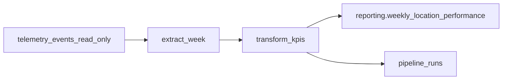

# PIPELINE_DESIGN — Brasaland Business Performance Pipeline

**Milestone:** M6 Part 1 (design)  
**Source of truth:** [`CONTEXT-brasaland-pipeline.md`](./CONTEXT-brasaland-pipeline.md)  
**Status:** Design only — no application code in this PR.

---

## §1 Current State

### As-built telemetry

Brasaland already captures inventory and auth telemetry through the backoffice `TelemetryService` and the Telemetry API (`services/telemetry`, port 8013). The as-built system:

- **Catalog:** eleven approved event types (`supply_order_created`, `supply_order_failed`, `consumption_order_created`, `consumption_order_failed`, `stock_threshold_triggered`, `direct_stock_edit_rejected`, `user_login_failed`, `session_expired`, `order_form_abandoned`, `ingredient_list_viewed`, `user_login_succeeded`) defined in `docs/telemetry/event-schemas.json` (contract **v2.1.0**) and enforced by `services/telemetry/allowlists.py`.
- **Envelope:** every event carries `eventId`, `timestamp`, `sessionId`, `userId`, `event_type`, `schemaVersion` (`2.1.0`), `requestId`, `service`, and a per-type `properties` object.
- **Persistence:** table `public.telemetry_events` (brasaland-m5) has eight columns — `id`, `event_id` (UNIQUE), `event_type`, `timestamp`, `service`, `level`, `tags` (JSONB = properties), `context` (JSONB = session/user/request/schemaVersion). Source: `services/telemetry/db_models.py`.
- **Ingest dedup:** `bulk_insert_events` uses `INSERT … ON CONFLICT DO NOTHING` on `event_id` (`services/telemetry/repository.py`).
- **Engineering report:** `GET /telemetry/report` (backed by `analysis.py` / `report_pipeline.py`) serves operational / engineer-facing aggregates. It is **out of scope** for this milestone and must not be modified (`CONTEXT` §7).

Optional purchase cost is already on the wire for supply events: `tags.unit_cost` on `supply_order_created` (inventory PR **#34**, telemetry contract PR **#35**). Consumption events do not carry cost; waste valuation is a pipeline concern.

### Gap

Mariana (CEO) and Felipe (Operations Director) need a **Weekly Location Cost & Waste Report** — a Monday-fresh, per-location, per-country rollup of purchase cost, waste cost, waste ratio, stockouts, and price alerts. That business-facing product does **not** exist today. Raw events and the engineering telemetry report do not produce weekly cost/waste KPIs for non-technical stakeholders. This pipeline exists solely to close that gap.

---

## §2 Purpose

Build a Prefect-orchestrated ETL that reads `telemetry_events` read-only, aggregates into `reporting.weekly_location_performance`, and exposes results through a new `services/reporting/` API — producing one row per `(location_id, week_start)` with the five CONTEXT KPIs: **Purchase Cost per Location** (`total_purchase_cost` from `supply_order_created` × quantity using `tags.unit_cost`), **Waste Cost per Location** (`total_waste_cost` from waste exits valued at latest supply `unit_cost`), **Waste Ratio** (`waste_ratio`), **Stockout Frequency** (`stockout_events_count` from `stock_threshold_triggered`), and **Price Alert Frequency** (`price_alert_events_count` derived in transform from supply cost history).

---

## §3 Extraction

### Source and filters

| Aspect | Rule |
| --- | --- |
| Table | `public.telemetry_events` — **read-only** |
| `event_type` SQL filter | exactly three values: `supply_order_created`, `consumption_order_created`, `stock_threshold_triggered` |
| Waste | **not** a fourth event type — filter `tags->>'reason' = 'waste'` **within** `consumption_order_created` |
| Window | ISO week half-open interval `[week_start, week_start + 7 days)` where `week_start` is Monday 00:00:00 UTC |
| Columns used | `event_id`, `event_type`, `timestamp`, `tags`, `context` |

`outbound_order_created` / non-waste consumption rows may be extracted with consumption (same `event_type`) for operational context in later anomaly checks; they do **not** feed any of the five v1 KPIs except when `reason = 'waste'`.

### Arrival format

Each extracted row arrives as a tabular record shaped like the SQLModel/SQLAlchemy ORM row (or a pandas-equivalent dict):

| Field | Type | Notes |
| --- | --- | --- |
| `event_id` | text | Unique; already deduped at ingest |
| `event_type` | text | One of the three filter values |
| `timestamp` | timestamptz | Event time in UTC |
| `tags` | JSONB / dict | Event properties (e.g. `ingredient_id`, `quantity`, `location_id`, `unit_cost`, `reason`) |
| `context` | JSONB / dict | Envelope metadata (`sessionId`, `userId`, `requestId`, `schemaVersion`) |

`location_id` in `tags` is an underscore slug (e.g. `medellin_centro`), matching live backoffice/telemetry capture — not the hyphenated sample in the CONTEXT JSON example.

---

## §4 Data Flow



### Stage 1 — `extract_week`

- Connect to brasaland-m5 with credentials from a Prefect block (see §8).
- Select rows where `event_type IN (…)`, `timestamp >= week_start AND timestamp < week_start + 7 days`.
- Return a dataframe / list of records (`records_extracted` count written to the run log).
- No writes.

### Stage 2 — `transform_kpis`

Implements CONTEXT aggregation + locked reconciliations:

1. **Location dimensions.** Map each underscore `location_id` through a module-constant table of 14 entries → `(country, currency)` (`CO`/`COP` or `US`/`USD`). Never mix currencies in one aggregate row.
2. **Purchase cost.** For `supply_order_created`: line cost = `quantity * unit_cost` when `tags.unit_cost` is a number; when missing/null, treat line cost as `0` and increment `missing_cost_events_count` for the run.
3. **Waste cost.** For `consumption_order_created` with `tags.reason = 'waste'`: value `quantity * latest_supply_unit_cost(ingredient_id, location_id)` where “latest” means the most recent cost-bearing `supply_order_created` at or before the waste timestamp for that pair. If no prior cost exists, cost `0` and count toward data quality.
4. **Stockouts.** Count `stock_threshold_triggered` per location in the week → `stockout_events_count`.
5. **Price alerts.** See **§11.1 Price-alert derivation rule** (concrete median / ±25% rule). No source event named `ingredient_price_variance_detected`.
6. **Waste ratio.** `total_waste_cost / total_purchase_cost`, or `0` if purchases are `0`.
7. Emit one in-memory row per `(location_id, week_start)` matching the destination columns.

### Stage 3 — `load_weekly_performance`

- Upsert into `reporting.weekly_location_performance` on `unique (location_id, week_start)`.
- Write / update `pipeline_runs` with status, counts, and DQ fields.
- On failure, mark the run `Failed` with `error_detail` (see §6 for re-run semantics).

---

## §5 Destination

### DDL (CONTEXT verbatim)

```sql
create table reporting.weekly_location_performance (
  id uuid primary key default gen_random_uuid(),
  location_id text not null,
  country text not null,
  week_start date not null,
  total_purchase_cost numeric not null default 0,
  total_waste_cost numeric not null default 0,
  waste_ratio numeric not null default 0,
  stockout_events_count integer not null default 0,
  price_alert_events_count integer not null default 0,
  currency text not null,
  computed_at timestamptz not null default now(),
  unique (location_id, week_start)
);
```

Also create `reporting.pipeline_runs` (see §7) in the same schema.

### Schema and RLS policy (two lanes)

Per `docs/standards/agent-workflow.md`:

| Lane | Responsibility |
| --- | --- |
| **Lane 1** | Table/column shapes via SQLModel metadata + `ensure_schema()` in `services/reporting/` (`models.py` is source of truth). |
| **Lane 2** | Idempotent operator script(s) under `scripts/` for anything SQLModel cannot express: `CREATE SCHEMA IF NOT EXISTS reporting`, unique constraint if needed beyond model args, and **RLS enablement**. Always `--dry-run` first. |

**RLS flag:** today’s [`scripts/enable_rls.py`](../../scripts/enable_rls.py) only queries and alters tables in `schemaname = 'public'`. Part 2 **must** extend that script (or add a sibling Lane-2 script) so `reporting.weekly_location_performance` and `reporting.pipeline_runs` get RLS enabled after `create_all`. New tables must still be listed for the operator RLS obligation. Until Part 2, do not assume `enable_rls.py` covers `reporting.*`.

Destination uses **NUMERIC** for money (CONTEXT). Source telemetry stores optional `unit_cost` as float (inventory A1 tradeoff); precision is enforced at the reporting destination.

---

## §6 Update handling and idempotency

### Upsert key

Idempotency for the destination grain relies on `unique (location_id, week_start)`.

Load strategy: `INSERT … ON CONFLICT (location_id, week_start) DO UPDATE SET …` for all KPI columns and `computed_at = now()`.

### Second-run-after-partial-failure narrative

1. Run begins; extract succeeds; transform succeeds; load writes **some** location rows then fails (connection drop / timeout) → run marked `Failed`, `error_detail` set, `records_loaded` reflects partial success if known.
2. Operator (or `POST /reporting/pipeline-runs`) triggers the **same** `week_start` again.
3. Extract re-reads the same immutable event set; transform recomputes the full week; load **upserts** every location row. Rows written in the failed run are overwritten with the complete recomputation; missing rows are inserted. Outcome after a successful second run: destination matches a clean single-run result for that week.
4. A new `pipeline_runs` row is inserted for the retry (history preserved); it ends `Completed`.

### Source-level dedup

Already guaranteed at ingest: `telemetry_events.event_id` is UNIQUE and inserts use `ON CONFLICT DO NOTHING`. The pipeline does not re-dedupe source events beyond trusting that constraint. It aggregates by week/location, not by replaying idempotent inserts of raw events.

---

## §7 Execution log (`pipeline_runs`)

Proposed table (Part 2 SQLModel + Lane-2 as needed), fields:

| Field | Type | Justification |
| --- | --- | --- |
| `run_id` | UUID PK | Stable identifier for API (`/pipeline-runs/latest`) and support tickets |
| `started_at` | timestamptz | Observability: when the Prefect flow entered Running |
| `finished_at` | timestamptz nullable | Duration / SLA; null while Running |
| `status` | text | `Running` / `Completed` / `Failed` — Prefect-aligned terminal states |
| `week_start` | date | Which ISO week the run targeted |
| `records_extracted` | integer | Prove extract touch-points; detect empty-window mishaps |
| `records_loaded` | integer | Prove load completeness vs expected 14 locations |
| `missing_cost_events_count` | integer | Data-quality field for historical/null `unit_cost` (A1/A2 gap) |
| `error_detail` | text nullable | Recoverability: operator-visible root cause on Failed |

Justification theme: every field answers an ops question Mariana/Felipe will not ask, but engineers and Felipe’s on-calls will — “did Monday’s run finish, for which week, how much data was poor-quality, and why did it fail?”

---

## §8 Prefect mapping

| Concept | Mapping |
| --- | --- |
| **Flow** | `weekly_location_performance_flow(week_start: date \| None)` — default previous completed ISO week or “current week for recompute” policy set in Part 2 |
| **Tasks** | `extract_week`, `transform_kpis`, `load_weekly_performance`, `write_pipeline_run_start`, `write_pipeline_run_finish` |
| **States** | Prefect 3: `Running` while work proceeds; terminal `Completed` / `Failed` mirrored into `pipeline_runs.status` |
| **Retries** | Retry (e.g. 3× exponential backoff) on tasks that touch Postgres (extract, load, run-log writes). Pure transform is deterministic given the extract snapshot and need not retry for I/O |
| **Blocks** | Prefect Secret / connection block holding Supabase `DATABASE_URL` (same brasaland-m5 project as inventory/telemetry). Never hard-code secrets in `data/pipelines/` |
| **Package layout (Part 2)** | `data/pyproject.toml` own uv project; run with `uv run --directory data python -m pipelines.pipeline` (module form — direct `python pipelines/pipeline.py` fails with `ModuleNotFoundError` for `pipelines`) and `uv run --directory data pytest …` |

ETL logic lives under `data/pipelines/`. `services/reporting/` imports those callables; the reverse import is forbidden.

---

## §9 Endpoints (design only)

New service `services/reporting/` on port **8014** (structural template: `services/telemetry`). Auth convention for v1 reads: open GETs matching current inventory/telemetry read style; mutations can stay unauthenticated for local/ops trigger until a later auth milestone — document as Part 2 decision locked to CONTEXT contracts.

| Method | Path | Behavior | Future `data/pipelines` function |
| --- | --- | --- | --- |
| `GET` | `/reporting/weekly-location-performance` | Optional `week_start` query; default = most recent computed week; returns CONTEXT JSON shape (`week_start` + `locations[]`) | `query_weekly_location_performance(week_start: date \| None) -> dict` |
| `GET` | `/reporting/pipeline-runs/latest` | Status/metadata of last run | `query_latest_pipeline_run() -> dict` |
| `POST` | `/reporting/pipeline-runs` | Triggers a manual run (optional body for `week_start`) | `trigger_pipeline_run(week_start: date \| None) -> dict` → invokes Prefect flow or same sync entrypoint as CLI |

Response field names and nesting must match CONTEXT §6 (except `location_id` values will be underscore slugs in this repo — see Discrepancy Register).

---

## §10 Spec design answers (our stack)

### Idempotency (×3)

1. **Re-running the same week:** upsert on `unique (location_id, week_start)` replaces KPI columns; destination stays singular for the grain.
2. **Duplicate source events:** impossible for a given `event_id` after ingest (`UNIQUE` + `ON CONFLICT DO NOTHING`); aggregates remain stable.
3. **Manual POST then scheduled run:** both write the same grain; last successful upsert wins with identical math if source data unchanged.

### Observability (×3)

1. **`pipeline_runs` row** per attempt with status, counts, and `missing_cost_events_count`.
2. **Prefect UI / logs** for task-level Running/Completed/Failed and retry attempts.
3. **API surface** `GET /reporting/pipeline-runs/latest` for ops without DB access.

### Recoverability (×3)

1. **Failed mid-load:** re-run same week; upsert completes the set (narrative in §6).
2. **Bad deploy / bad transform:** code fix + re-run week(s); no irreversible mutates on `telemetry_events`.
3. **`error_detail` + Prefect state** give the breadcrumbs to retry safely.

### Concurrent runs

Two runs for the **same** `week_start` concurrently can race on upserts (last writer wins) and create two `pipeline_runs` rows — acceptable if last Completed row reflects a full recompute. Part 2 should add a short advisory lock or “one Running row per `week_start`” check on `POST` / flow start to avoid concurrent transforms stomping each other needlessly. Different weeks may run in parallel safely (disjoint conflict keys).

**Part 3 — Additional activity (spec enhancement from this §10 answer):** We shipped the **one-Running-row-per-`week_start`** guard in `write_pipeline_run_start` (Part 2). A second concurrent start for the same week raises before extract/transform. **Design question answered:** Concurrent runs. **Why prioritized:** Same-week stomps were the highest-risk race (overlapping upserts + confused ops history); rejecting a second Running row is cheaper and clearer than inventing a separate advisory-lock layer.

---

## §11 Event translation table

| CONTEXT name | Repo / pipeline source |
| --- | --- |
| `inbound_order_created` | `supply_order_created` |
| `outbound_order_created` | `consumption_order_created` |
| `stock_waste_registered` | `consumption_order_created` where `tags.reason = 'waste'` |
| `stock_threshold_triggered` | `stock_threshold_triggered` (exact match) |
| `ingredient_price_variance_detected` | **No source event** — derived in transform (§11.1) |

Repo names are canonical in code, SQL filters, and allowlists. CONTEXT names appear only in translation and discrepancy notes.

### §11.1 Price-alert derivation rule

For each `supply_order_created` in the target ISO week that has a numeric `tags.unit_cost`, compute a trailing baseline = the **median** `unit_cost` of cost-bearing `supply_order_created` events for the same `(ingredient_id, location_id)` over the **prior 4 ISO weeks** (exclusive of the target week; only events with a numeric `unit_cost` count). Flag a price alert when that order’s `unit_cost` deviates from the baseline by more than **±25%**. `price_alert_events_count` for a location-week equals the count of flagged orders for that location in the week. Orders with **no baseline** (fewer than **2** prior cost-bearing events for that pair) **never** alert. In Part 2 the baseline window and threshold are module constants (`PRICE_ALERT_BASELINE_WEEKS`, `PRICE_ALERT_THRESHOLD_PCT`) so they are tunable without redesign.

---

## §12 Discrepancy Register

| Topic | CONTEXT / external expectation | Decision | Rationale |
| --- | --- | --- | --- |
| Destination table name | Spec screenshots may say `reporting.business_metrics` | Use **`reporting.weekly_location_performance`** (CONTEXT DDL verbatim) | CONTEXT is the graded source of truth for schema |
| Event vocabulary | CONTEXT uses inbound/outbound/waste/price names | **Translation table §11**; SQL uses repo names | Live telemetry + v2.1.0 allowlists already ship repo names |
| Price alerts | Appears as emitted event `ingredient_price_variance_detected` | **Derived** in transform (§11.1); no new event type | Avoids inventing emitters; history lives in supply costs (PR #35) |
| Waste valuation | Implies cost on waste event | Value waste at **latest supply `unit_cost`** for `(ingredient_id, location_id)`; missing → 0 + DQ | A1 kept cost off `IngredientExit` by design |
| Slug format | CONTEXT sample JSON shows `medellin-centro` | Emit/store **underscore** slugs (`medellin_centro`) | Matches `uis/backoffice/lib/locations.ts` + telemetry `locationId` enum |
| Cost-field history | CONTEXT asks to “add cost now” | Already done: PR **#34** (inventory `unit_cost`), PR **#35** (optional telemetry `unit_cost` on supply, contract v2.1.0) | Design inherits; pipeline must handle historical null costs |

---

## Run command and schedule (Part 2)

Implemented entrypoint:

```text
uv run --directory data python -m pipelines.pipeline
```

Use the **module** form (`-m pipelines.pipeline`). Running `python pipelines/pipeline.py` directly fails with `ModuleNotFoundError: No module named 'pipelines'` because the file is not executed as a package.

Defaults to the most recent complete ISO week (Monday 00:00 UTC of the week that has fully ended). Optional programmatic override: `weekly_location_performance_flow(week_start=...)`.

**Intended weekly schedule:** Mondays after **00:15 UTC**, targeting the prior complete ISO week (so Monday-morning freshness for Mariana/Felipe without racing midnight writes).

Part 3 will add:

```text
uv run --directory data pytest tests/pipelines/test_pipeline.py
```

---

## Graded-task coverage checklist

| # | Graded ask | Section |
| --- | --- | --- |
| 1 | Current state / as-built telemetry | §1 |
| 2 | Gap / business need | §1 |
| 3 | Purpose | §2 |
| 4 | Extraction sources / filters / window | §3 |
| 5 | Arrival format | §3 |
| 6 | Data-flow diagram ≥3 stages | §4 |
| 7 | Transform rules (waste, price, DQ) | §4 + §11.1 |
| 8 | Destination DDL | §5 |
| 9 | Lane-1 / Lane-2 / RLS | §5 |
| 10 | Idempotency / upsert | §6 |
| 11 | Second-run narrative | §6 |
| 12 | Source-level dedup | §6 |
| 13 | Execution log | §7 |
| 14 | Prefect mapping | §8 |
| 15 | API endpoints | §9 |
| 16 | Spec design Qs | §10 |
| 17 | Event translation | §11 |
| 18 | Discrepancy register | §12 |
