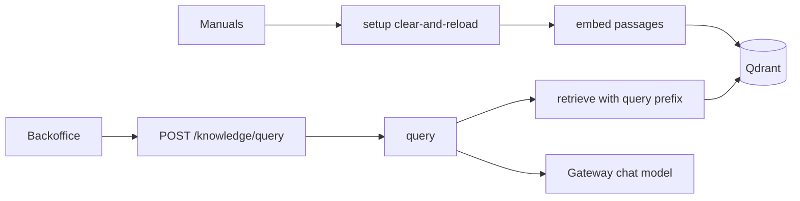

# Brasaland RAG design (Milestone 7)

## End-to-end flow

1. **Sources** — four manuals under `docs/company-knowledge-base/` (`loyalty-program`, `waste-protocol`, `menu-allergens`, `supplier-ordering`).
2. **Index (operator)** — `scripts/index_knowledge_base.py` calls `pipelines.rag.setup()` (not FastAPI lifespan).
3. **Chunk** — section-aware markdown split; ≥3 chunks per document; payload fields per CONTEXT §3.
4. **Embed** — `fastembed` `BAAI/bge-small-en-v1.5` (384-dim), passages **without** `query:` prefix; lazy-init inside `embed()`.
5. **Store** — Qdrant collection `brasaland_knowledge`, Cosine distance; clear-and-reload on each `setup()`.
6. **Retrieve** — question embedded with `query: ` prefix; top-k filtered by `min_score` (**0.55**, validated).
7. **Generate** — one chat completion via OpenAI-compatible 4Geeks gateway (`GENERATION_MODEL_ID`); salesperson prompt; answer string only.
8. **Serve** — `POST /knowledge/query` (JWT) → backoffice `/knowledge` UI (Bearer + auth guard).

## Chunking strategy

Manuals are short policy docs with headings and lists. Chunking follows markdown headings (`#`–`###`), then paragraphs, then sentence boundaries — never mid-sentence — so each chunk stays a self-contained rule or FAQ. We require ≥3 chunks per document (CONTEXT §5) so retrieval can distinguish sections (e.g. Gold tier vs redemption vs FAQ).

## Embedding practices

| Setting | Value | Why |
| --- | --- | --- |
| Model | `BAAI/bge-small-en-v1.5` via fastembed | Local embeddings (gateway has chat only); lighter than torch; 384-dim |
| Metric | Cosine | Standard for these embeddings |
| Query prefix | `query: ` on questions only | BGE asymmetric retrieval convention |
| `min_score` | **0.55** (Cosine, validated) | Recall@3 = 100% (9/9) on `data/eval/test-queries.json` (≥80% KPI); did not block correct hits; honest-miss path declines out-of-corpus questions |

Two different models: **embed** = local BGE; **generate** = DeepSeek (or other) chat model ID on `https://llm.4geeks.ai`.

## Auth

Endpoint is JWT-guarded because generation is **metered**. UI uses `InventoryAuthGuard` and Bearer tokens. Light mode only (backoffice has no dark theme).

## Corpus path

`KNOWLEDGE_CORPUS_PATH` configures the directory. Compose mounts `./docs/company-knowledge-base` read-only into the knowledge container; native runs default to the repo-relative path.
