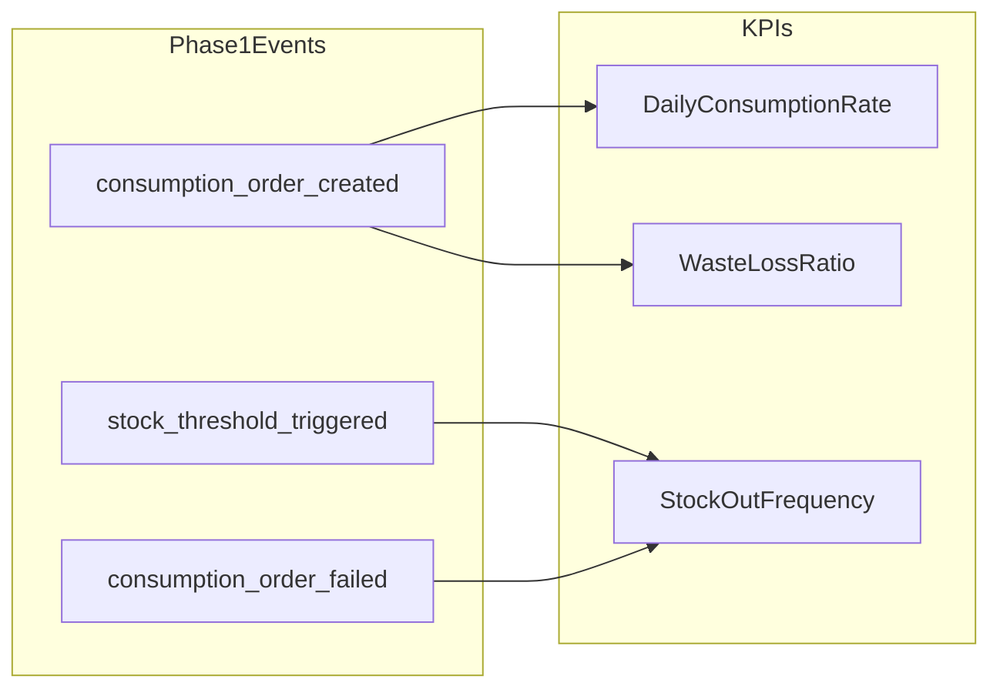
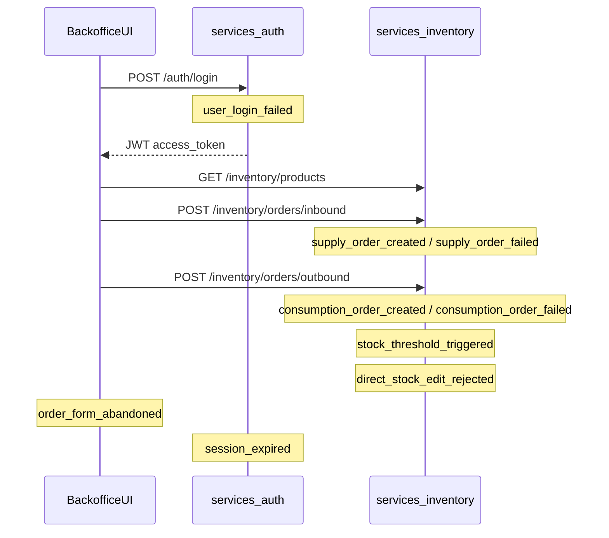

# Brasaland Digital — Telemetry Phase 1 Plan

_Internal design document for 4Geeks Academy AI Engineering Track (W16D46)._

## 1. Purpose & scope

This document responds to the Brasaland operations RFI: **what data must the inventory backoffice capture so Felipe Guerrero (Operations Director) and Mariana (CEO) can answer questions the system cannot yet answer?**

Phase 1 defines instrumentation for Brasaland's 14-location inventory backoffice — from authenticated login through inbound `SupplyOrder` and outbound `ConsumptionOrder` completion — and maps each event to one of three operational KPIs. It does not prescribe storage technology, pipelines, or dashboard implementation.

**Audience:** Operations (Felipe), leadership (Mariana), engineering (Nicolás Park, CTO).

**In scope:**

- Event envelope and catalog for nine approved events
- Stream vs batch delivery decisions with business-urgency justification
- Throttle and debounce rules for high-volume signals
- JSON Schema property allowlists (`event-schemas.json`)

**Out of scope (non-goals):**

- Instrumentation code in FastAPI or Next.js
- Telemetry warehouse, ETL, or visualization
- Direct stock-level edits (stock is always derived from orders)
- Navigation analytics that do not survive the golden-rule test
- Any personally identifiable information (names, emails, cleartext IP addresses)

Canonical entity names used throughout: **Ingredient**, **SupplyOrder**, **ConsumptionOrder**.

---

## 2. The 3 KPIs

### KPI 1 — Daily consumption rate by ingredient and location

**Definition:** Units consumed per ingredient per location per day, derived from `ConsumptionOrder` records.

| Aspect | Detail |
| --- | --- |
| **Data sources** | `consumption_order_created` — `ingredient_id`, `location_id`, `quantity`, `created_at`, `reason` |
| **Generation point** | Post-commit hook on `POST /inventory/orders/outbound` success; nightly batch roll-up aggregates per `(ingredient_id, location_id, date)` |
| **Business decision** | Detect locations overconsuming relative to sales; adjust supplier orders and portion controls |

### KPI 2 — Stock-out frequency

**Definition:** Number of times an ingredient's stock hit zero or fell to or below `min_stock_threshold` in a reporting period.

| Aspect | Detail |
| --- | --- |
| **Data sources** | `stock_threshold_triggered` — threshold crossings; `consumption_order_failed` — `failure_code = insufficient_stock` |
| **Generation point** | Post-commit stock evaluation after any order that changes stock; stream alerts on threshold crossing |
| **Business decision** | Identify chronically under-stocked ingredients; renegotiate supply contracts and safety-stock levels |

### KPI 3 — Waste and loss ratio

**Definition:** Proportion of `ConsumptionOrder` volume where `reason ∈ {waste, spoilage, theft}` versus total consumption volume in a period.

| Aspect | Detail |
| --- | --- |
| **Data sources** | `consumption_order_created` — `reason`, `quantity`, `location_id` |
| **Generation point** | Post-commit hook on outbound order success; weekly batch aggregation by location |
| **Business decision** | Flag locations with abnormal waste patterns; trigger operational investigation |

---

## 3. Instrumentation map (Phase 1)

Phase 1 covers the authenticated flow from backoffice login through order completion. Hooks below are **planned instrumentation points** — not yet implemented in code.

### Instrumentation points

| # | Event | Layer | Trigger |
| --- | --- | --- | --- |
| 1 | `user_login_failed` | `services/auth` — `auth_login` 401; `uis/backoffice` login page | Failed login (wrong credentials or locked account); expired sessions → `session_expired` |
| 2 | `session_expired` | `services/auth` — `POST /auth/refresh` 401; `InventoryAuthGuard` redirect | Invalid refresh token or missing access token |
| 3 | `supply_order_created` | `services/inventory` — `create_inbound_order` after commit | Successful inbound `SupplyOrder` |
| 4 | `supply_order_failed` | Same route — ingredient 404 or validation error | Rejected inbound order |
| 5 | `consumption_order_created` | `services/inventory` — `create_outbound_order` after commit | Successful outbound `ConsumptionOrder` |
| 6 | `consumption_order_failed` | Same route — invalid `reason` (422) or insufficient stock (400) | Rejected outbound order |
| 7 | `stock_threshold_triggered` | Post-commit hook (planned) — compare location stock to `min_stock_threshold` | Stock crosses from above to at or below threshold |
| 8 | `direct_stock_edit_rejected` | API boundary (planned) — reject non-order stock mutation | Any attempt to PATCH/PUT stock directly |
| 9 | `order_form_abandoned` | `uis/backoffice` inbound/outbound form pages | User leaves form without submit (30s debounce) |

**Inventory instrumentation (6 points):** `supply_order_created`, `supply_order_failed`, `consumption_order_created`, `consumption_order_failed`, `stock_threshold_triggered`, `direct_stock_edit_rejected`.

**Backoffice instrumentation (3 points):** `user_login_failed`, `session_expired`, `order_form_abandoned`.

---

## 4. Event envelope definition

Every telemetry event shares a common envelope. Field-level validation is defined in `event-schemas.json` under `#/definitions/eventEnvelope`.

| Field | Type | Rule |
| --- | --- | --- |
| `eventId` | UUID v4 | Unique per emission; generated at capture time |
| `timestamp` | ISO 8601 UTC | e.g. `2026-07-08T04:21:00Z` |
| `sessionId` | string | Browser or app session correlation ID |
| `userId` | string | Opaque TinyDB user UUID — never name or email |
| `event_type` | string | `entity_action` taxonomy in snake_case |
| `schemaVersion` | string | `"1.0.0"` for Phase 1 |
| `requestId` | string | HTTP request correlation (UUID or trace ID) |
| `properties` | object | Event-specific payload; keys restricted by per-event JSON Schema allowlist |

The envelope `userId` identifies who triggered the action. Event-specific `created_by` inside `properties` records the order author when it differs from the session actor.

---

## 5. Event catalog

Nine events survive the golden-rule test. Each entry includes trigger, golden-rule justification, property allowlist, sensitivity flags, and delivery mode.

**Delivery legend:** STREAM = near-real-time for operational response; BATCH = tolerates hourly or daily lag for aggregation.

---

### 5.1 `supply_order_created`

| Aspect | Detail |
| --- | --- |
| **Trigger** | A `SupplyOrder` is successfully registered via `POST /inventory/orders/inbound` |
| **Golden rule** | We capture `supply_order_created` because we need to know which ingredients arrived at which locations and in what quantities, which allows us to make the decision to reconcile supplier deliveries and adjust reorder cadence. |
| **Delivery** | **BATCH** — supplier reconciliation and daily roll-up; no immediate kitchen action required |

**Property allowlist:**

| Property | Type | Required | Notes |
| --- | --- | --- | --- |
| `supply_order_id` | integer | yes | Registered order ID |
| `ingredient_id` | integer | yes | |
| `quantity` | number | yes | Units in ingredient's measure |
| `supplier_id` | integer | yes | Supplier directory reference |
| `location_id` | integer (1–14) | yes | Receiving location |
| `created_by` | string (UUID) | yes | Opaque user identifier |

**PII / sensitivity:** `created_by` is opaque UUID only. No supplier contact data.

---

### 5.2 `supply_order_failed`

| Aspect | Detail |
| --- | --- |
| **Trigger** | A `SupplyOrder` is rejected (unknown ingredient, invalid quantity, validation error) |
| **Golden rule** | We capture `supply_order_failed` because we need to know which inbound registrations fail and why, which allows us to make the decision to fix data-entry errors and unblock receiving workflows. |
| **Delivery** | **BATCH** — ops review queue; failures are not time-critical for kitchen service |

**Property allowlist:**

| Property | Type | Required | Notes |
| --- | --- | --- | --- |
| `ingredient_id` | integer | yes | |
| `quantity` | number | yes | Attempted quantity |
| `supplier_id` | integer | no | Present when supplier was selected |
| `location_id` | integer (1–14) | yes | |
| `failure_code` | string | yes | e.g. `ingredient_not_found`, `validation_error` |
| `failure_message` | string | yes | API error detail (no PII) |

**PII / sensitivity:** None.

---

### 5.3 `consumption_order_created`

| Aspect | Detail |
| --- | --- |
| **Trigger** | A `ConsumptionOrder` is successfully registered via `POST /inventory/orders/outbound` |
| **Golden rule** | We capture `consumption_order_created` because we need to know daily consumption and waste by ingredient and location, which allows us to make the decision to detect overconsumption and investigate abnormal waste patterns. |
| **Delivery** | **BATCH** — feeds KPI 1 and KPI 3 via hourly or daily aggregation |

**Property allowlist:**

| Property | Type | Required | Notes |
| --- | --- | --- | --- |
| `consumption_order_id` | integer | yes | |
| `ingredient_id` | integer | yes | |
| `quantity` | number | yes | |
| `reason` | enum | yes | `kitchen_use`, `waste`, `spoilage`, `theft` |
| `location_id` | integer (1–14) | yes | |
| `created_by` | string (UUID) | yes | Opaque user identifier |
| `restricted_access` | boolean | yes | Must be `true` when `reason = theft` |

**PII / sensitivity:** `reason = theft` requires `restricted_access: true`. Access limited to Operations Director and CTO.

---

### 5.4 `consumption_order_failed`

| Aspect | Detail |
| --- | --- |
| **Trigger** | A `ConsumptionOrder` is rejected (insufficient stock, invalid reason, validation error) |
| **Golden rule** | We capture `consumption_order_failed` because we need to know when kitchens cannot complete an outbound order due to stock constraints, which allows us to make the decision to expedite replenishment before service is disrupted. |
| **Delivery** | **STREAM** — blocked kitchen order is actionable immediately; a Friday-night Miami stock-out cannot wait for batch processing |

**Property allowlist:**

| Property | Type | Required | Notes |
| --- | --- | --- | --- |
| `ingredient_id` | integer | yes | |
| `quantity` | number | yes | Requested quantity |
| `reason` | string | no | Attempted reason as submitted; plain string (not the consumption enum) so invalid values that caused validation failure are captured |
| `location_id` | integer (1–14) | yes | |
| `failure_code` | string | yes | e.g. `insufficient_stock`, `invalid_reason` |
| `available_stock` | number | no | Present when `failure_code = insufficient_stock` |

**PII / sensitivity:** None.

---

### 5.5 `stock_threshold_triggered`

| Aspect | Detail |
| --- | --- |
| **Trigger** | An ingredient's location stock falls to or below `min_stock_threshold` after an order completes |
| **Golden rule** | We capture `stock_threshold_triggered` because we need to know the moment an ingredient crosses its safety threshold at a specific location, which allows us to make the decision to trigger an emergency reorder before a stock-out halts service. |
| **Delivery** | **STREAM** — threshold crossing during peak service requires immediate ops alert |

**Property allowlist:**

| Property | Type | Required | Notes |
| --- | --- | --- | --- |
| `ingredient_id` | integer | yes | |
| `location_id` | integer (1–14) | yes | |
| `current_stock` | number | yes | Stock after triggering order |
| `min_stock_threshold` | number | yes | Configured threshold |
| `currency` | enum | yes | `COP` or `USD` — valuation context for threshold review |

**PII / sensitivity:** None. `currency` reflects location country (Colombia = COP, Florida = USD).

---

### 5.6 `direct_stock_edit_rejected`

| Aspect | Detail |
| --- | --- |
| **Trigger** | A request to modify stock directly (outside an order) is blocked by the API |
| **Golden rule** | We capture `direct_stock_edit_rejected` because we need to know when users attempt to bypass the order-based stock model, which allows us to make the decision to enforce data integrity and retrain staff on correct workflows. |
| **Delivery** | **STREAM** — policy violation is a data-integrity signal requiring prompt review |

**Property allowlist:**

| Property | Type | Required | Notes |
| --- | --- | --- | --- |
| `ingredient_id` | integer | yes | |
| `location_id` | integer (1–14) | yes | |
| `attempted_action` | string | yes | e.g. `patch_stock`, `put_stock` |
| `rejection_reason` | string | yes | e.g. `stock_read_only` |

**PII / sensitivity:** None.

---

### 5.7 `user_login_failed`

| Aspect | Detail |
| --- | --- |
| **Trigger** | Failed login attempt (wrong credentials or locked account). Expired sessions are covered by the `session_expired` event. |
| **Golden rule** | We capture `user_login_failed` because we need to know when authentication failures spike at a location, which allows us to make the decision to investigate credential compromise or session-configuration issues. |
| **Delivery** | **STREAM** — possible credential attack; burst aggregation applies (see §6) |

**Property allowlist:**

| Property | Type | Required | Notes |
| --- | --- | --- | --- |
| `failure_reason` | enum | yes | `wrong_credentials`, `account_locked` |
| `source` | string | yes | e.g. `backoffice` |
| `attempt_count` | integer | yes | Aggregated count within burst window |

**PII / sensitivity:** No email, username, or cleartext IP. Burst key uses hashed IP server-side only — hash is not emitted in the event.

---

### 5.8 `session_expired`

| Aspect | Detail |
| --- | --- |
| **Trigger** | User session timed out and was invalidated (refresh token rejected or guard redirect) |
| **Golden rule** | We capture `session_expired` because we need to know how often operators lose active sessions mid-shift, which allows us to make the decision to adjust session TTL and reduce form-abandonment friction. |
| **Delivery** | **BATCH** — UX and session analytics; low operational urgency |

**Property allowlist:**

| Property | Type | Required | Notes |
| --- | --- | --- | --- |
| `idle_duration_ms` | integer | yes | Time since last authenticated activity |
| `source` | string | yes | e.g. `backoffice` |

**PII / sensitivity:** None. Session identity is carried in the envelope `sessionId` field only.

---

### 5.9 `order_form_abandoned`

| Aspect | Detail |
| --- | --- |
| **Trigger** | User starts but does not complete a `SupplyOrder` or `ConsumptionOrder` form within the debounce window |
| **Golden rule** | We capture `order_form_abandoned` because we need to know which order forms operators start but never submit, which allows us to make the decision to simplify form UX and reduce incomplete inventory records. |
| **Delivery** | **BATCH** — form friction analysis; debounced to avoid noise (see §6) |

**Property allowlist:**

| Property | Type | Required | Notes |
| --- | --- | --- | --- |
| `order_type` | enum | yes | `supply`, `consumption` |
| `location_id` | integer (1–14) | yes | Selected location |
| `form_session_id` | string | yes | Unique per form open |
| `ingredient_id` | integer | no | Present only if ingredient was selected |

**PII / sensitivity:** None.

---

## 6. Throttle and debounce strategy

| Event | Strategy |
| --- | --- |
| `user_login_failed` | Burst aggregation: emit at most one event per `(source, client_ip_hash)` per 60-second window. Subsequent failures within the window increment `attempt_count` on the same emission rather than creating duplicate events. |
| `order_form_abandoned` | 30-second debounce after last field interaction. Emit once per `form_session_id`. Reset debounce timer on each keystroke or selection change. |
| `stock_threshold_triggered` | Fire once per `(ingredient_id, location_id)` threshold **crossing** — when stock transitions from above `min_stock_threshold` to at or below it. Suppress repeat events while stock remains at or below threshold. Re-arm only after stock is replenished above threshold via a `SupplyOrder`. |

---

## 7. Risks and exclusions

### Discarded events

| Candidate event | Reason excluded |
| --- | --- |
| `ingredient_list_viewed` | Fails golden rule — observability only; no operational decision attached. Listing ingredients does not indicate consumption, waste, or stock risk. |
| `location_filter_applied` | Fails golden rule — navigation noise. KPI segmentation already requires `location_id` on order and threshold events. |
| `user_login_succeeded` | Fails golden rule — no decision attached. Successful login is implicit in downstream order events that carry `created_by`. |

### Dual-currency constraint

Colombian locations value ingredients in **COP**; Florida locations in **USD**. Any event carrying cost or valuation context must include `currency` with enum `COP` or `USD`. Phase 1 applies this to `stock_threshold_triggered` where threshold review may involve monetary safety-stock planning.

### Multi-location constraint

Any event originating from a specific restaurant location must include `location_id` (integer 1–14). This applies to all six inventory events and `order_form_abandoned`. Auth events (`user_login_failed`, `session_expired`) are session-scoped and do not require `location_id`.

### Theft sensitivity

`ConsumptionOrder` events with `reason = theft` must set `restricted_access: true` in `consumption_order_created`. Downstream storage and dashboards must enforce role-based access limited to the Operations Director and CTO.

### No-PII rule

- `userId` and `created_by` are opaque TinyDB UUID strings — never names or email addresses.
- `user_login_failed` must not include email, username, or cleartext IP in `properties`.
- API error messages in failure events must not echo user-supplied credentials.

---

## 8. Mapping to current implementation

This section maps canonical telemetry entities to the existing `services/inventory/` and `services/auth/` codebases. No service changes are proposed in Phase 1.

### Entity mapping

| Canonical (CONTEXT) | Current code (`services/inventory/models.py`) | Route |
| --- | --- | --- |
| `Ingredient` | `Ingredient` | `GET/POST /inventory/products` |
| `SupplyOrder` | `IngredientEntry` | `POST /inventory/orders/inbound` |
| `ConsumptionOrder` | `IngredientExit` | `POST /inventory/orders/outbound` |

Auth instrumentation maps to `services/auth/app.py` (`auth_login`, `auth_refresh`) and `uis/backoffice` (`login/page.tsx`, `InventoryAuthGuard`).

### Fields CONTEXT requires that the current schema lacks

| Field | Required on | Current state |
| --- | --- | --- |
| `location_id` | `Ingredient` | Missing — `current_stock` is computed globally per ingredient; entry/exit totals are not scoped by location in `_ingredients_with_stock_stmt` |
| `min_stock_threshold` | `Ingredient` | Missing — no threshold column or alert logic |
| `currency` | `Ingredient` | Missing — model has `country` (`CO`/`US`) instead of `COP`/`USD` |
| `supplier_id` | `SupplyOrder` | Missing — `IngredientEntry` uses `supplier_name` (string) |
| `reason` (full enum) | `ConsumptionOrder` | Partial — API accepts only `consumption` or `waste` (`VALID_EXIT_REASONS`); CONTEXT expects `kitchen_use`, `waste`, `spoilage`, `theft` |

**Additional notes:**

- CONTEXT `created_by` maps to `user_uuid` on `IngredientEntry` and `IngredientExit`. Auth JWT exposes numeric `user_id` via `get_current_user_uuid` in `dependencies.py`; telemetry treats these as opaque string identifiers.
- `direct_stock_edit_rejected` has no route today — stock mutation outside orders is prevented by API design (no PATCH/PUT on stock).
- `stock_threshold_triggered` requires `min_stock_threshold` and per-location stock, neither of which exists yet — instrumentation is forward-looking at the post-commit hook.

---

## Related artifacts

- Event JSON Schemas: [`event-schemas.json`](./event-schemas.json)
- Inventory service models: `services/inventory/models.py`
- Auth service routes: `services/auth/app.py`
