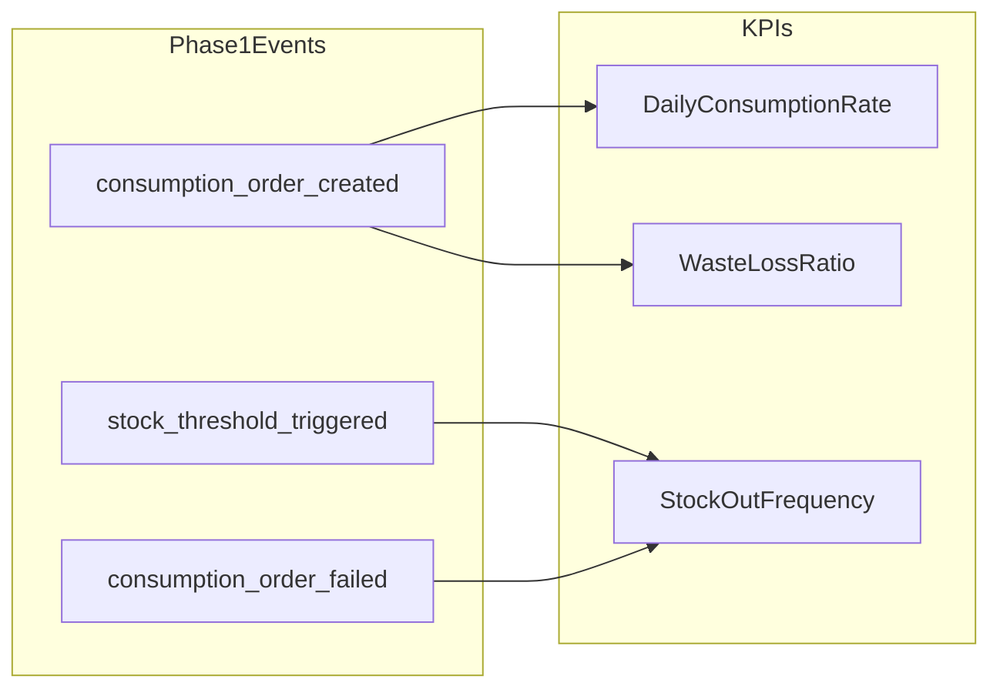
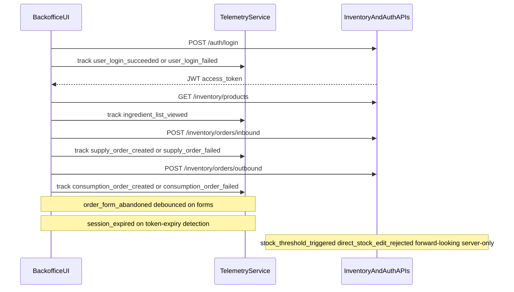

# Brasaland Digital — Telemetry Phase 1 Plan

_Internal design document for 4Geeks Academy AI Engineering Track (W16D46)._

## 1. Purpose & scope

This document responds to the Brasaland operations RFI: **what data must the inventory backoffice capture so Felipe Guerrero (Operations Director) and Mariana (CEO) can answer questions the system cannot yet answer?**

Phase 1 defines instrumentation for Brasaland's 14-location inventory backoffice — from authenticated login through inbound `SupplyOrder` and outbound `ConsumptionOrder` completion — and maps each event to one of three operational KPIs. It does not prescribe storage technology, pipelines, or dashboard implementation.

**Audience:** Operations (Felipe), leadership (Mariana), engineering (Nicolás Park, CTO).

**In scope:**

- Event envelope and catalog for eleven approved events
- Stream vs batch delivery decisions with business-urgency justification
- Throttle and debounce rules for high-volume signals
- JSON Schema property allowlists (`event-schemas.json`)
- Capture specification for a frontend `TelemetryService` in `uis/backoffice` (design only — no implementation in this document)

**Out of scope (non-goals):**

- Instrumentation **implementation** code in FastAPI or Next.js (capture behavior is specified here; building `TelemetryService` and wiring call sites is a separate engineering task)
- Telemetry warehouse, ETL, or visualization
- Direct stock-level edits (stock is always derived from orders)
- Navigation analytics that do not survive the golden-rule test
- Any personally identifiable information (names, emails, cleartext IP addresses)

Canonical entity names used throughout: **Ingredient**, **SupplyOrder**, **ConsumptionOrder**.

### Version history

- **1.0.0** — Initial submitted design (W16D46): nine-event catalog, backend-oriented instrumentation map, envelope without `service`.
- **2.0.0** — This amendment:
  - Mandatory envelope field `service`
  - `schemaVersion` bump to `2.0.0`
  - Re-admission of `ingredient_list_viewed` and `user_login_succeeded`
  - Capture layer moved to frontend `TelemetryService` in `uis/backoffice` (§3)
  - `location_id` in event properties is a location slug string (not integer 1–14)
  - `consumption_order_created.reason` aligned to API values `consumption` | `waste`
  - Capture-layer metadata sourcing documented (§8): `location_id`, `sessionId`, `userId`, server-derived `level`
  - Eleven approved catalog events (was nine)
- **2.1.0** — Optional `unit_cost` on `supply_order_created` only (not required; `consumption_order_created` not extended). Requires inventory A1 (`IngredientEntry.unit_cost`). `schemaVersion` bump to `2.1.0`. Waste cost stays out of the consumption event; the M6 pipeline values waste at the ingredient's latest supply `unit_cost`.

---

## 2. The 3 KPIs

### KPI 1 — Daily consumption rate by ingredient and location

**Definition:** Units consumed per ingredient per location per day, derived from `ConsumptionOrder` records.

| Aspect | Detail |
| --- | --- |
| **Data sources** | `consumption_order_created` — `ingredient_id`, `location_id`, `quantity`, `created_at`, `reason` |
| **Generation point** | `TelemetryService.track('consumption_order_created', …)` on outbound form success in `uis/backoffice`; nightly batch roll-up aggregates per `(ingredient_id, location_id, date)` |
| **Business decision** | Detect locations overconsuming relative to sales; adjust supplier orders and portion controls |

### KPI 2 — Stock-out frequency

**Definition:** Number of times an ingredient's stock hit zero or fell to or below `min_stock_threshold` in a reporting period.

| Aspect | Detail |
| --- | --- |
| **Data sources** | `stock_threshold_triggered` — threshold crossings; `consumption_order_failed` — `failure_code = insufficient_stock` |
| **Generation point** | `TelemetryService.track('consumption_order_failed', …)` on outbound form catch for insufficient stock; `stock_threshold_triggered` is forward-looking server-side (see §3) |
| **Business decision** | Identify chronically under-stocked ingredients; renegotiate supply contracts and safety-stock levels |

### KPI 3 — Waste and loss ratio

**Definition:** Proportion of `ConsumptionOrder` volume where `reason ∈ {waste, spoilage, theft}` versus total consumption volume in a period.

_Note (2.0.0):_ The implemented API emits `consumption` | `waste` only. KPI 3 uses `waste` from live events; `spoilage` and `theft` are forward-looking canonical values not yet emittable.

| Aspect | Detail |
| --- | --- |
| **Data sources** | `consumption_order_created` — `reason`, `quantity`, `location_id` |
| **Generation point** | `TelemetryService.track('consumption_order_created', …)` on outbound form success; weekly batch aggregation by location |
| **Business decision** | Flag locations with abnormal waste patterns; trigger operational investigation |

---

## 3. Instrumentation map (Phase 1)

Phase 1 capture is client-side via a single `TelemetryService` in `uis/backoffice` exposing `track(eventType, properties)`. All implemented events are emitted from UI call sites; the v1.0.0 backend capture model is superseded by frontend `TelemetryService` capture (storage and report phases are separate). Hooks below are **planned instrumentation points** — not yet implemented in code.

### Instrumentation points

| # | Event | Layer | Trigger |
| --- | --- | --- | --- |
| 1 | `user_login_succeeded` | `uis/backoffice` — `TelemetryService.track` — login page success | Successful login after location selected |
| 2 | `user_login_failed` | Same — login page catch | Failed login (wrong credentials or locked account) |
| 3 | `session_expired` | Same — token-expiry detection / guard | JWT expired or missing; user redirected to login |
| 4 | `ingredient_list_viewed` | Same — products list mount | `getProducts()` resolves on products page or `ProductSelect` |
| 5 | `supply_order_created` | Same — inbound form success | `createInbound()` resolves |
| 6 | `supply_order_failed` | Same — inbound form catch | `createInbound()` rejects |
| 7 | `consumption_order_created` | Same — outbound form success | `createOutbound()` resolves |
| 8 | `consumption_order_failed` | Same — outbound form catch | `createOutbound()` rejects |
| 9 | `order_form_abandoned` | Same — inbound/outbound forms | User leaves form without submit (30s debounce, §6) |
| 10 | `stock_threshold_triggered` | `services/inventory` — **forward-looking / not implemented** | Post-commit threshold crossing when per-location stock exists |
| 11 | `direct_stock_edit_rejected` | `services/inventory` — **forward-looking / not implemented** | API rejects non-order stock mutation |

**Frontend instrumentation (9 points):** `user_login_succeeded`, `user_login_failed`, `session_expired`, `ingredient_list_viewed`, `supply_order_created`, `supply_order_failed`, `consumption_order_created`, `consumption_order_failed`, `order_form_abandoned`.

**Forward-looking server instrumentation (2 points):** `stock_threshold_triggered`, `direct_stock_edit_rejected` — the only future server-side emitters in v2.0.0.

---

## 4. Event envelope definition

Every telemetry event shares a common envelope. Field-level validation is defined in `event-schemas.json` under `#/definitions/eventEnvelope`.

| Field | Type | Rule |
| --- | --- | --- |
| `eventId` | UUID v4 | Unique per emission; generated at capture time |
| `timestamp` | ISO 8601 UTC | e.g. `2026-07-08T04:21:00Z` |
| `sessionId` | string | Browser or app session correlation ID |
| `userId` | string | Opaque stringified numeric TinyDB user id (JWT `sub`); never name or email |
| `event_type` | string | `entity_action` taxonomy in snake_case |
| `schemaVersion` | string | `"2.1.0"` for Phase 1 v2.1 |
| `requestId` | string | HTTP request correlation (UUID or trace ID) |
| `service` | string | Emitting application identifier (e.g. `"backoffice"`) |
| `properties` | object | Event-specific payload; keys restricted by per-event JSON Schema allowlist |

The envelope `userId` identifies who triggered the action. Event-specific `created_by` inside `properties` records the order author when it differs from the session actor; both are opaque stringified numeric TinyDB user ids.

---

## 5. Event catalog

Eleven events survive the golden-rule test. Each entry includes trigger, golden-rule justification, property allowlist, sensitivity flags, and delivery mode.

**Delivery legend:** STREAM = near-real-time for operational response; BATCH = tolerates hourly or daily lag for aggregation.

---

### 5.1 `supply_order_created`

| Aspect | Detail |
| --- | --- |
| **Trigger** | A `SupplyOrder` is successfully registered via `POST /inventory/orders/inbound` |
| **Golden rule** | We capture `supply_order_created` because we need to know which ingredients arrived at which locations and in what quantities, which allows us to make the decision to reconcile supplier deliveries and adjust reorder cadence. |
| **Delivery** | **BATCH** — supplier reconciliation and daily roll-up; no immediate kitchen action required |

**Property allowlist:**

| Property | Type | Required | Notes |
| --- | --- | --- | --- |
| `supply_order_id` | integer | yes | Registered order ID |
| `ingredient_id` | integer | yes | |
| `quantity` | number | yes | Units in ingredient's measure |
| `unit_cost` | number | no | Optional purchase cost per unit (≥ 0). We capture it because purchase and waste cost KPIs need delivered cost at the supply event so operations can decide reorder economics and waste valuation (M6). Emitted only when the inventory API returns a numeric `unit_cost`. |
| `supplier_id` | integer | yes | Supplier directory reference |
| `location_id` | string (location slug) | yes | Numeric form value translated to slug by TelemetryService at capture |
| `created_by` | string | yes | Opaque stringified numeric TinyDB user id |

`consumption_order_created` omits cost. The M6 pipeline values waste at the ingredient's latest supply `unit_cost`.

**PII / sensitivity:** `created_by` is opaque id only. No supplier contact data.

---

### 5.2 `supply_order_failed`

| Aspect | Detail |
| --- | --- |
| **Trigger** | A `SupplyOrder` is rejected (unknown ingredient, invalid quantity, validation error) |
| **Golden rule** | We capture `supply_order_failed` because we need to know which inbound registrations fail and why, which allows us to make the decision to fix data-entry errors and unblock receiving workflows. |
| **Delivery** | **BATCH** — ops review queue; failures are not time-critical for kitchen service |

**Property allowlist:**

| Property | Type | Required | Notes |
| --- | --- | --- | --- |
| `ingredient_id` | integer | yes | |
| `quantity` | number | yes | Attempted quantity |
| `supplier_id` | integer | no | Present when supplier was selected |
| `location_id` | string (location slug) | yes | Numeric form value translated to slug by TelemetryService at capture |
| `failure_code` | string | yes | e.g. `ingredient_not_found`, `validation_error` |
| `failure_message` | string | yes | API error detail (no PII) |

**PII / sensitivity:** None.

---

### 5.3 `consumption_order_created`

| Aspect | Detail |
| --- | --- |
| **Trigger** | A `ConsumptionOrder` is successfully registered via `POST /inventory/orders/outbound` |
| **Golden rule** | We capture `consumption_order_created` because we need to know daily consumption and waste by ingredient and location, which allows us to make the decision to detect overconsumption and investigate abnormal waste patterns. |
| **Delivery** | **BATCH** — feeds KPI 1 and KPI 3 via hourly or daily aggregation |

**Property allowlist:**

| Property | Type | Required | Notes |
| --- | --- | --- | --- |
| `consumption_order_id` | integer | yes | |
| `ingredient_id` | integer | yes | |
| `quantity` | number | yes | |
| `reason` | enum | yes | `consumption`, `waste` (API-emitted values) |
| `location_id` | string (location slug) | yes | Numeric form value translated to slug by TelemetryService at capture |
| `created_by` | string | yes | Opaque stringified numeric TinyDB user id |
| `restricted_access` | boolean | yes | Must be `true` when `reason = theft` (forward-compatible; `theft` is not currently emittable by the API) |

**PII / sensitivity:** `reason = theft` (forward-compatible) requires `restricted_access: true`. Access limited to Operations Director and CTO.

---

### 5.4 `consumption_order_failed`

| Aspect | Detail |
| --- | --- |
| **Trigger** | A `ConsumptionOrder` is rejected (insufficient stock, invalid reason, validation error) |
| **Golden rule** | We capture `consumption_order_failed` because we need to know when kitchens cannot complete an outbound order due to stock constraints, which allows us to make the decision to expedite replenishment before service is disrupted. |
| **Delivery** | **STREAM** — blocked kitchen order is actionable immediately; a Friday-night Miami stock-out cannot wait for batch processing |

**Property allowlist:**

| Property | Type | Required | Notes |
| --- | --- | --- | --- |
| `ingredient_id` | integer | yes | |
| `quantity` | number | yes | Requested quantity |
| `reason` | string | no | Attempted reason as submitted; plain string (not the consumption enum) so invalid values that caused validation failure are captured |
| `location_id` | string (location slug) | yes | Numeric form value translated to slug by TelemetryService at capture |
| `failure_code` | string | yes | e.g. `insufficient_stock`, `invalid_reason` |
| `available_stock` | number | no | Present when `failure_code = insufficient_stock` |

**PII / sensitivity:** None.

---

### 5.5 `stock_threshold_triggered`

| Aspect | Detail |
| --- | --- |
| **Trigger** | An ingredient's location stock falls to or below `min_stock_threshold` after an order completes |
| **Golden rule** | We capture `stock_threshold_triggered` because we need to know the moment an ingredient crosses its safety threshold at a specific location, which allows us to make the decision to trigger an emergency reorder before a stock-out halts service. |
| **Delivery** | **STREAM** — threshold crossing during peak service requires immediate ops alert |

**Property allowlist:**

| Property | Type | Required | Notes |
| --- | --- | --- | --- |
| `ingredient_id` | integer | yes | |
| `location_id` | string (location slug) | yes | Numeric form value translated to slug by TelemetryService at capture |
| `current_stock` | number | yes | Stock after triggering order |
| `min_stock_threshold` | number | yes | Configured threshold |
| `currency` | enum | yes | `COP` or `USD` — valuation context for threshold review |

**PII / sensitivity:** None. `currency` reflects location country (Colombia = COP, Florida = USD).

---

### 5.6 `direct_stock_edit_rejected`

| Aspect | Detail |
| --- | --- |
| **Trigger** | A request to modify stock directly (outside an order) is blocked by the API |
| **Golden rule** | We capture `direct_stock_edit_rejected` because we need to know when users attempt to bypass the order-based stock model, which allows us to make the decision to enforce data integrity and retrain staff on correct workflows. |
| **Delivery** | **STREAM** — policy violation is a data-integrity signal requiring prompt review |

**Property allowlist:**

| Property | Type | Required | Notes |
| --- | --- | --- | --- |
| `ingredient_id` | integer | yes | |
| `location_id` | string (location slug) | yes | Numeric form value translated to slug by TelemetryService at capture |
| `attempted_action` | string | yes | e.g. `patch_stock`, `put_stock` |
| `rejection_reason` | string | yes | e.g. `stock_read_only` |

**PII / sensitivity:** None.

---

### 5.7 `user_login_failed`

| Aspect | Detail |
| --- | --- |
| **Trigger** | Failed login attempt (wrong credentials or locked account). Expired sessions are covered by the `session_expired` event. |
| **Golden rule** | We capture `user_login_failed` because we need to know when authentication failures spike at a location, which allows us to make the decision to investigate credential compromise or session-configuration issues. |
| **Delivery** | **STREAM** — possible credential attack; burst aggregation applies (see §6) |

**Property allowlist:**

| Property | Type | Required | Notes |
| --- | --- | --- | --- |
| `failure_reason` | enum | yes | `wrong_credentials`, `account_locked` |
| `source` | string | yes | e.g. `backoffice` |
| `attempt_count` | integer | yes | Aggregated count within burst window |

**PII / sensitivity:** No email, username, or cleartext IP. Pre-authentication event — no `location_id` in properties (location context comes from paired `user_login_succeeded` events at report time).

---

### 5.8 `session_expired`

| Aspect | Detail |
| --- | --- |
| **Trigger** | User session timed out and was invalidated (JWT expired or guard redirect) |
| **Golden rule** | We capture `session_expired` because we need to know how often operators lose active sessions mid-shift, which allows us to make the decision to adjust session TTL and reduce form-abandonment friction. |
| **Delivery** | **BATCH** — UX and session analytics; low operational urgency |

**Property allowlist:**

| Property | Type | Required | Notes |
| --- | --- | --- | --- |
| `idle_duration_ms` | integer | yes | Time since last authenticated activity |
| `source` | string | yes | e.g. `backoffice` |

**PII / sensitivity:** None. Session identity is carried in the envelope `sessionId` field only. No `location_id` — session-scoped.

---

### 5.9 `order_form_abandoned`

| Aspect | Detail |
| --- | --- |
| **Trigger** | User starts but does not complete a `SupplyOrder` or `ConsumptionOrder` form within the debounce window |
| **Golden rule** | We capture `order_form_abandoned` because we need to know which order forms operators start but never submit, which allows us to make the decision to simplify form UX and reduce incomplete inventory records. |
| **Delivery** | **BATCH** — form friction analysis; debounced to avoid noise (see §6) |

**Property allowlist:**

| Property | Type | Required | Notes |
| --- | --- | --- | --- |
| `order_type` | enum | yes | `supply`, `consumption` |
| `location_id` | string (location slug) | yes | Numeric form value translated to slug by TelemetryService at capture |
| `form_session_id` | string | yes | Unique per form open |
| `ingredient_id` | integer | no | Present only if ingredient was selected |

**PII / sensitivity:** None.

---

### 5.10 `ingredient_list_viewed`

| Aspect | Detail |
| --- | --- |
| **Trigger** | Products list mounts successfully in `uis/backoffice` (`app/inventory/products/page.tsx` or `ProductSelect` load) |
| **Golden rule** | We capture `ingredient_list_viewed` because we need to know whether managers consult stock levels before placing orders and how often per location, which allows us to decide where to focus operator training and whether stock visibility is driving ordering decisions. |
| **Delivery** | **BATCH** |

**Property allowlist:**

| Property | Type | Required | Notes |
| --- | --- | --- | --- |
| `location_id` | string (location slug) | yes | From login location selector (sessionStorage) |
| `item_count` | integer | yes | Count of ingredients returned |

**PII / sensitivity:** None.

---

### 5.11 `user_login_succeeded`

| Aspect | Detail |
| --- | --- |
| **Trigger** | Successful login on `uis/backoffice` login page |
| **Golden rule** | We capture `user_login_succeeded` because we need to know total daily login attempts per location as the denominator for the login failure rate, which allows us to decide which locations need credential-management intervention. |
| **Delivery** | **BATCH** |

**Property allowlist:**

| Property | Type | Required | Notes |
| --- | --- | --- | --- |
| `location_id` | string (location slug) | yes | From login location selector (sessionStorage) |

**PII / sensitivity:** None.

---

## 6. Throttle and debounce strategy

| Event | Strategy |
| --- | --- |
| `user_login_failed` | Client-side burst aggregation in `TelemetryService`: emit at most one event per `source` per 60-second window. Subsequent failures within the window increment `attempt_count` on the same emission rather than creating duplicate events. |
| `order_form_abandoned` | 30-second debounce after last field interaction. Emit once per `form_session_id`. Reset debounce timer on each keystroke or selection change. |
| `stock_threshold_triggered` | Fire once per `(ingredient_id, location_id)` threshold **crossing** — when stock transitions from above `min_stock_threshold` to at or below it. Suppress repeat events while stock remains at or below threshold. Re-arm only after stock is replenished above threshold via a `SupplyOrder`. |

---

## 7. Risks and exclusions

### Discarded events

| Candidate event | Reason excluded |
| --- | --- |
| `location_filter_applied` | Fails golden rule — navigation noise. KPI segmentation already requires `location_id` on order and threshold events. |

`ingredient_list_viewed` and `user_login_succeeded` were re-admitted in **2.0.0** because the report phase assigned each a concrete operational decision (stock-visibility training focus; login-failure-rate denominator).

### Dual-currency constraint

Colombian locations value ingredients in **COP**; Florida locations in **USD**. Any event carrying cost or valuation context must include `currency` with enum `COP` or `USD`. Phase 1 applies this to `stock_threshold_triggered` where threshold review may involve monetary safety-stock planning.

### Multi-location constraint

Any event originating from a specific restaurant location must include `location_id` as a location slug in `properties`. This applies to all six inventory events, `order_form_abandoned`, `ingredient_list_viewed`, and `user_login_succeeded`. Pre-authentication auth events (`user_login_failed`, `session_expired`) do not carry `location_id`.

### Theft sensitivity

`ConsumptionOrder` events with `reason = theft` must set `restricted_access: true` in `consumption_order_created`. Downstream storage and dashboards must enforce role-based access limited to the Operations Director and CTO. `theft` is not an emittable `reason` value in the current inventory API (`consumption` | `waste` only); the JSON Schema conditional on `reason = theft` is retained for forward compatibility.

### No-PII rule

- `userId` and `created_by` are opaque stringified numeric TinyDB user ids — never names or email addresses.
- `user_login_failed` must not include email, username, or cleartext IP in `properties`.
- API error messages in failure events must not echo user-supplied credentials.

---

## 8. Mapping to current implementation

This section maps canonical telemetry entities to the existing `services/inventory/` and `services/auth/` codebases and specifies how the frontend `TelemetryService` sources capture metadata. No application code changes are proposed in this document.

### Entity mapping

| Canonical (CONTEXT) | Current code (`services/inventory/models.py`) | Route |
| --- | --- | --- |
| `Ingredient` | `Ingredient` | `GET/POST /inventory/products` |
| `SupplyOrder` | `IngredientEntry` | `POST /inventory/orders/inbound` |
| `ConsumptionOrder` | `IngredientExit` | `POST /inventory/orders/outbound` |

Capture instrumentation maps to `uis/backoffice` — a single `TelemetryService.track(eventType, properties)` called from login, products list, and inbound/outbound form success/catch paths. `stock_threshold_triggered` and `direct_stock_edit_rejected` remain forward-looking server-side emitters (exception to frontend capture).

### Fields CONTEXT requires that the current schema lacks

| Field | Required on | Current state |
| --- | --- | --- |
| `location_id` | `Ingredient` | Missing — `current_stock` is computed globally per ingredient; entry/exit totals are not scoped by location in `_ingredients_with_stock_stmt` |
| `min_stock_threshold` | `Ingredient` | Missing — no threshold column or alert logic |
| `currency` | `Ingredient` | Missing — model has `country` (`CO`/`US`) instead of `COP`/`USD` |
| `supplier_id` | `SupplyOrder` | Missing — `IngredientEntry` uses `supplier_name` (string) |
| `reason` (canonical enum) | `ConsumptionOrder` | Implemented API emits `consumption` \| `waste` only (`VALID_EXIT_REASONS` in `services/inventory/routers/inventory.py`); canonical `kitchen_use` maps to `consumption`; `spoilage` and `theft` are forward-looking |

### Capture-layer metadata sourcing

- **`location_id`:** `properties.location_id` is always a location slug string (see map below). Order events (`supply_*`, `consumption_*`, `order_form_abandoned`) read the numeric form field (1–14) on inbound/outbound pages; `TelemetryService` translates it to the slug before `track()`. Non-form events (`ingredient_list_viewed`, `user_login_succeeded`) use the slug from the login-page location selector persisted in `sessionStorage`.
- **`sessionId`:** UUID v4 generated at login, stored in `sessionStorage`. `TelemetryService` generates one lazily if absent before first `track()`.
- **`userId`:** Opaque stringified numeric TinyDB user id from JWT `sub` (not a UUID). Sourced client-side by decoding the JWT payload in `TelemetryService` (no server round-trip).
- **`level`:** Not an envelope field. Derived server-side at storage: `event_type` ending in `_failed` or `_rejected` → `"warning"`; all other events → `"info"`.
- **`service`:** Set by `TelemetryService` to `"backoffice"` for all v2.0.0 capture emissions.

#### Integer form value → location slug (canonical map)

| Form value | Slug | Country |
| --- | --- | --- |
| 1 | `medellin_centro` | Colombia |
| 2 | `medellin_poblado` | Colombia |
| 3 | `medellin_laureles` | Colombia |
| 4 | `bogota_zona_rosa` | Colombia |
| 5 | `bogota_chapinero` | Colombia |
| 6 | `bogota_usaquen` | Colombia |
| 7 | `bogota_norte` | Colombia |
| 8 | `cali_san_fernando` | Colombia |
| 9 | `cali_granada` | Colombia |
| 10 | `cali_ciudad_jardin` | Colombia |
| 11 | `miami_brickell` | USA |
| 12 | `miami_wynwood` | USA |
| 13 | `miami_coral_gables` | USA |
| 14 | `miami_kendall` | USA |

Incident-analysis branch codes (`COL-01` … `COL-10`, `FLA-01` … `FLA-04`) are a separate domain vocabulary; telemetry location slugs are not joined to them.

**Additional notes:**

- CONTEXT `created_by` maps to `user_uuid` on `IngredientEntry` and `IngredientExit`. Auth JWT exposes numeric `user_id` via `get_current_user_uuid` in `dependencies.py`; telemetry treats these as opaque string identifiers.
- `direct_stock_edit_rejected` has no route today — stock mutation outside orders is prevented by API design (no PATCH/PUT on stock). Future server-side emitter only.
- `stock_threshold_triggered` requires `min_stock_threshold` and per-location stock, neither of which exists yet — forward-looking server-side instrumentation.

---

## Related artifacts

- Event JSON Schemas: [`event-schemas.json`](./event-schemas.json)
- Inventory service models: `services/inventory/models.py`
- Auth service routes: `services/auth/app.py`
