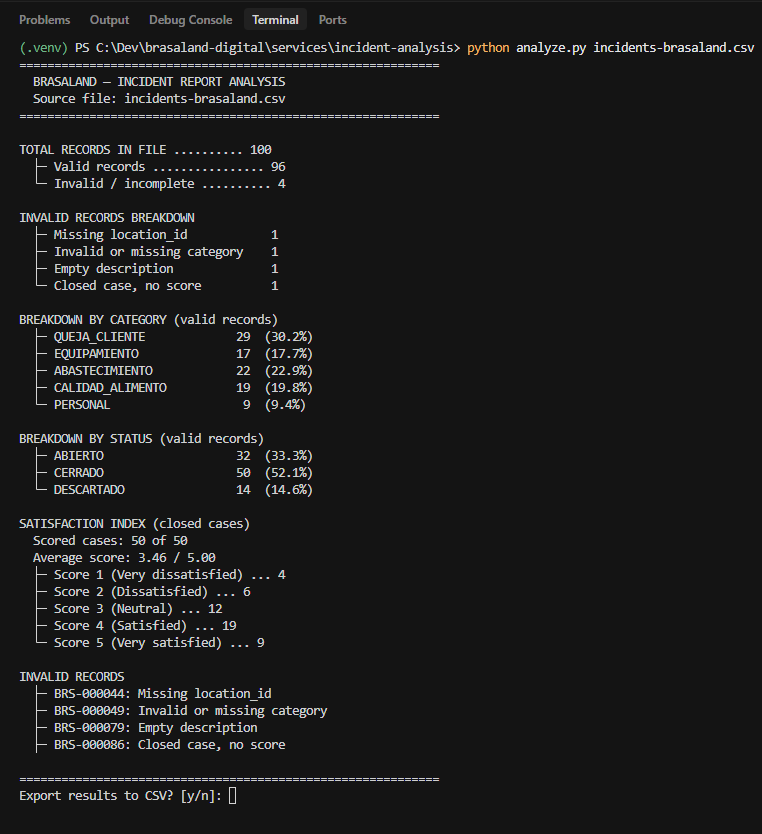
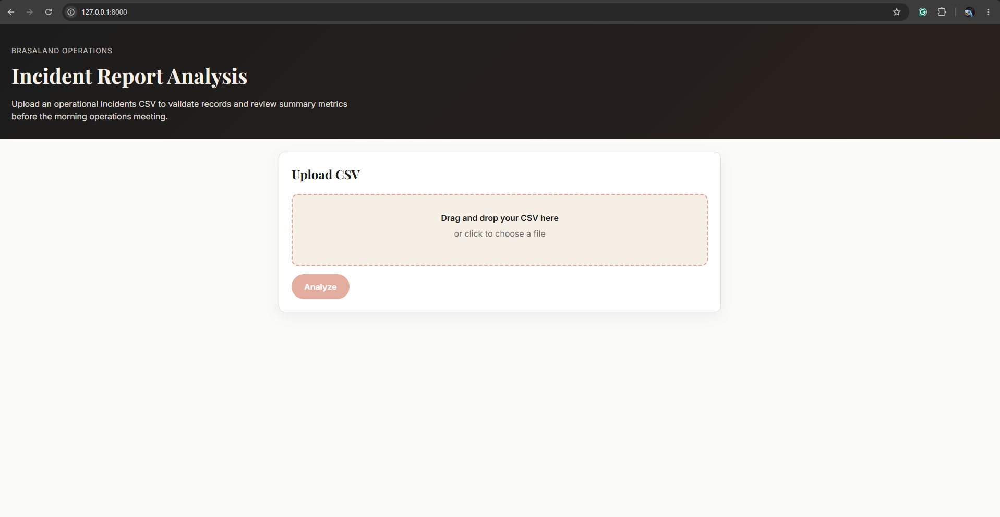

# Brasaland Incident Report Analysis

An internal Brasaland Operations utility that validates and summarizes operational-incident CSV exports before they feed the operations dashboard. The same analysis runs in three places from one shared core: a **CLI script** (`analyze.py`), a **FastAPI backend** (`app.py`), and a **web frontend** (`static/`). All validation rules and metric calculations live once in the `incident_analysis/` package and are reused by every entry point—never duplicated in the CLI, API, or UI.

## Architecture

The project follows a single-core, multi-consumer design. `incident_analysis/` owns CSV loading, per-record validation, summary metrics, export formatting, and the `run_analysis()` pipeline. `analyze.py` and `app.py` are thin wrappers that call the core; the frontend calls the API, which calls the same core.

**Design principle:** one core, three consumers, zero logic duplication.

```
services/incident-analysis/
├── incident_analysis/          # Shared core
│   ├── constants.py            # Column names, valid values, rule IDs
│   ├── loader.py               # UTF-8 CSV load and structure checks
│   ├── validator.py            # Six validation rules (all failures collected)
│   ├── metrics.py              # Totals, breakdowns, satisfaction average & distribution
│   ├── exporter.py             # Summary CSV export rows
│   ├── pipeline.py             # run_analysis() orchestration
│   └── types.py                # Row, validation, and result types
├── analyze.py                  # CLI entry point
├── app.py                      # FastAPI app + static file serving
├── static/                     # Single-page web UI (HTML, CSS, JS)
│   ├── index.html
│   ├── styles.css
│   └── app.js
├── tests/                      # pytest suite (golden fixture + unit + API tests)
├── incidents-brasaland.csv     # 100-row sample dataset
├── pyproject.toml               # Declared deps (locked in uv.lock)
└── README.md
```

## Setup

```powershell
cd services/incident-analysis
uv sync --python 3.13
```

Requires **Python 3.11+**. Dependencies are declared in `pyproject.toml`, locked in `uv.lock`, and managed with [uv](https://docs.astral.sh/uv/).

## CLI usage

Analyze the sample file and print a summary to the console:

```powershell
uv run python analyze.py incidents-brasaland.csv
```

Export metrics to CSV without prompts:

```powershell
uv run python analyze.py incidents-brasaland.csv --export results.csv
```

When run **without** `--export` in an **interactive** terminal, the CLI asks:

```text
Export results to CSV? [y/n]:
```

On `y` or `yes`, it prompts for a filename (default `results.csv`) and writes the export. Piped or non-interactive stdin skips the prompt.



## Web app usage

Start the server:

```powershell
uv run uvicorn app:app --reload --port 8000
```

Open **http://127.0.0.1:8000/** , upload `incidents-brasaland.csv`, click **Analyze**, then **Download CSV Summary**.

| Method | Path | Description |
| --- | --- | --- |
| `POST` | `/api/incidents/analyze` | Upload CSV (`multipart/form-data`, field `file`) → JSON summary + `result_id` (JWT required) |
| `GET` | `/api/incidents/results/{result_id}/export` | Download that analysis as `incident-summary.csv` (owner or admin JWT) |



## Validation rules

A row is **invalid** if any of these apply. **All** failed rules are recorded per row (validation does not stop at the first failure):

| Rule ID | Condition |
| --- | --- |
| `invalid_location` | Missing or not one of 14 valid location codes (`COL-01`…`COL-10`, `FLA-01`…`FLA-04`) |
| `invalid_category` | Missing or not one of five category codes |
| `invalid_description` | Empty or fewer than 5 characters after trimming |
| `missing_reporter` | Missing `reporter_id` |
| `cerrado_missing_score` | `status` is `CERRADO` and `satisfaction_score` is empty |
| `invalid_satisfaction_score` | Score present but not an integer 1–5 (e.g. `3.5` is invalid) |

## Verification

From `services/incident-analysis/`:

```powershell
uv run pytest
```

**25 tests** cover validator rules, metric edge cases, API endpoints, owner-scoped exports, and a golden fixture. The golden test loads the 100-row sample and asserts:

- **100** total records — **96** valid, **4** invalid
- Average satisfaction (closed, scored): **3.46**
- Category counts: **29** / **17** / **22** / **19** / **9**
- Status counts: **32** / **50** / **14**
- Score distribution: **4** / **6** / **12** / **19** / **9**

## Notes

- **Data vs. UI language:** Spanish incident descriptions and fixed category codes in the CSV are preserved as-is; all code, console labels, API messages, and documentation are in English.
- **Export state:** Analyze stores each result under a generated `result_id`, stamped with the caller's JWT identity and a TTL (`ANALYSIS_RESULT_TTL_SECONDS`, default 3600). Export requires that result id and allows only the owner or an admin.
- **Windows console:** The CLI reconfigures stdout/stderr to UTF-8 so box-drawing characters and accented text render correctly in PowerShell and cmd.
