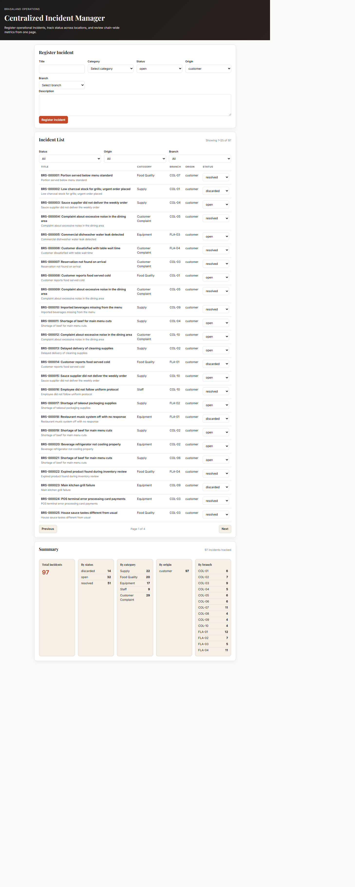
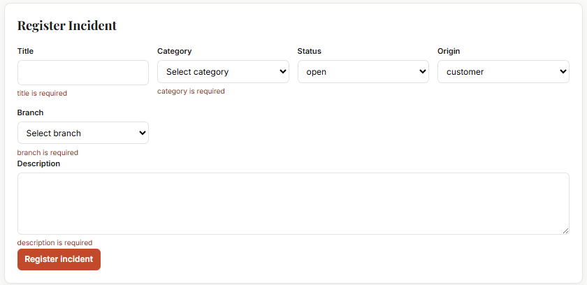

# Brasaland Centralized Incident Manager

An internal Brasaland Operations service for registering operational incidents, tracking their lifecycle across 14 locations, and viewing summary metrics. It is part of the **brasaland-digital** monorepo and replaces the spreadsheet workflow with a single TinyDB-backed store, a FastAPI REST API, and a three-panel web UI.

Field validation and lifecycle rules live once in **`packages/shared/brasaland_shared`** and are reused by the **seed script** and the **API** — never duplicated in the service layer.

## Architecture

**Design principle:** one shared core, two consumers (seed + API), zero validation duplication.

```
packages/shared/
└── brasaland_shared/              # Shared validation + lifecycle (editable install)
    ├── constants.py               # Categories, statuses, origins, branches
    ├── incident_validator.py      # Accumulate-all-errors field validation
    ├── lifecycle.py               # Status transition state machine
    └── types.py                   # FieldError, TransitionResult

services/incident-manager/
├── incident_manager/              # Service layer (TinyDB, seed mapping, translations)
│   ├── db.py                      # Lazy TinyDB singleton
│   ├── repository.py              # CRUD + id assignment
│   ├── service.py                 # create, list, summary, seed_batch, status updates
│   ├── seed_mapping.py            # CSV row → incident field mapping
│   ├── translations.py            # Spanish → English description map (seed-time only)
│   └── types.py                   # IncidentRecord, SeedReport, etc.
├── scripts/
│   └── seed_incidents.py          # CLI: load historical CSV into TinyDB
├── static/                        # Single-page web UI (HTML, CSS, JS)
│   ├── index.html
│   ├── styles.css
│   └── app.js
├── tests/                         # pytest (seed golden, API, static routes, translations)
├── data/                          # Runtime TinyDB (gitignored except .gitkeep)
├── app.py                         # FastAPI app + static file serving
├── CONTEXT-brasaland.md           # Data contract (authoritative)
├── requirements.txt               # -e ../../packages/shared (must install from this dir)
└── README.md
```

For categories, branches, CSV mapping, and the `CERRADO` → `resolved` assumption, see **`CONTEXT-brasaland.md`**.

## Data model

Each incident stored in TinyDB has the following fields:

| Field | Type | Description |
| --- | --- | --- |
| `id` | integer | Auto-assigned primary key |
| `source_incident_id` | string | Stable external ID (`BRS-XXXXXX` from CSV, or `MANUAL-{id}` for UI-created rows) |
| `title` | string | Short headline (required) |
| `description` | string | Full narrative (required; at least one non-whitespace character) |
| `category` | string | One of five fixed category codes (required) |
| `status` | string | Lifecycle status (required) |
| `origin` | string | Who reported the incident (required) |
| `branch` | string | Location or `Central` (required) |
| `created_at` | string | ISO 8601 UTC timestamp |
| `updated_at` | string | ISO 8601 UTC timestamp |

### Required fields

`title`, `description`, `category`, `status`, `origin`, `branch`

### Allowed values

| Field | Values |
| --- | --- |
| `category` | `QUEJA_CLIENTE`, `EQUIPAMIENTO`, `ABASTECIMIENTO`, `CALIDAD_ALIMENTO`, `PERSONAL` |
| `status` | `open`, `in_progress`, `resolved`, `discarded` |
| `origin` | `customer`, `branch`, `internal` |
| `branch` | `COL-01` … `COL-10`, `FLA-01` … `FLA-04`, `Central` |

New incidents created via the API default to `status: open`.

## Lifecycle

```
open ──────────► in_progress ──────────► resolved  (terminal)
 │                      │                      │
 │                      └──────────► discarded  (terminal)
 └──────────────────────────────────► discarded  (terminal)
```

| From | Allowed targets |
| --- | --- |
| `open` | `in_progress`, `discarded` |
| `in_progress` | `resolved`, `discarded` |
| `resolved` | _(none — terminal)_ |
| `discarded` | _(none — terminal)_ |

Illegal transitions (for example `open` → `resolved`, or any move out of a terminal state) are rejected with **HTTP 400** and a plain-text `detail` message from the lifecycle state machine.

## Categories

The five category **codes** are stored and validated as fixed IDs everywhere (API, database, seed). They are **not** translated as data.

English display labels are **UI-only** (list, summary, and registration dropdown):

| Code | Display label |
| --- | --- |
| `QUEJA_CLIENTE` | Customer Complaint |
| `EQUIPAMIENTO` | Equipment |
| `ABASTECIMIENTO` | Supply |
| `CALIDAD_ALIMENTO` | Food Quality |
| `PERSONAL` | Staff |

POST requests still send the raw code (e.g. `QUEJA_CLIENTE`).

## Setup (Windows PowerShell)

Run every command from **`services/incident-manager/`** so the editable install `../../packages/shared` resolves correctly.

```powershell
cd services/incident-manager
python -m venv .venv
.venv\Scripts\Activate.ps1
pip install -r requirements.txt
python scripts/seed_incidents.py
uvicorn app:app --reload --port 8011
```

Open **http://127.0.0.1:8011/**

Requires **Python 3.11+**.

## Seed

The seed script reads the historical CSV export (default: `services/incident-analysis/incidents-brasaland.csv`), maps each row to an incident record, and inserts into TinyDB.

- **Spanish descriptions** are translated to **English at seed-time** via `translations.py`. The CSV file is never edited.
- **`origin`** is set to `customer` for all seeded rows.
- **Idempotent:** re-running after a successful seed inserts **0** new rows (duplicates skipped by `source_incident_id`).

**Golden result (100-row fixture):** **97 inserted**, **3 rejected**

| `source_incident_id` | Reason |
| --- | --- |
| `BRS-000044` | missing / invalid branch (`location_id`) |
| `BRS-000049` | missing / invalid category |
| `BRS-000079` | empty description |

```powershell
python scripts/seed_incidents.py
```

Optional custom CSV path:

```powershell
python scripts/seed_incidents.py path\to\incidents.csv
```

## API endpoints

| Method | Path | Description | Success | Errors |
| --- | --- | --- | --- | --- |
| `POST` | `/api/incidents` | Create incident | **201** + body | **400** field errors; **500** generic |
| `GET` | `/api/incidents` | List incidents (optional `status`, `origin`, `branch`, `category` query filters) | **200** array (empty OK) | **400** invalid filter values; **500** |
| `GET` | `/api/incidents/summary` | Aggregated counts by status, category, origin, branch | **200** (zeros on empty DB) | **500** |
| `GET` | `/api/incidents/{id}` | Single incident by numeric `id` | **200** | **404** not found; **500** |
| `PATCH` | `/api/incidents/{id}/status` | Body: `{ "status": "..." }` — lifecycle transition | **200** + updated body | **400** illegal transition or invalid status; **404**; **500** |

## Error handling

- **400 validation** — field-level JSON: `{ "detail": { "errors": [{ "field": "...", "message": "..." }] } }`. All failed field checks are returned together (accumulate-all-errors).
- **400 lifecycle** — illegal status transition: `{ "detail": "<message>" }` (plain string).
- **404** — `{ "detail": "Incident not found" }` when `id` does not exist.
- **500** — `{ "detail": "An unexpected error occurred." }` with no stack trace exposed to clients.
- **Read endpoints** (`GET` list, summary, by id) never fail solely because the database is empty; list returns `[]`, summary returns zero counts.

## Frontend

Single-page UI at `/` with three panels:

| Panel | Purpose |
| --- | --- |
| **Register** | Create incidents; inline field errors on validation failure |
| **List** | Filterable table; inline status dropdown with optimistic update and revert on API failure |
| **Summary** | Metric cards by status, category, origin, and branch |

Each panel supports three states: **loading**, **empty**, and **error** (banner + Retry where applicable).

**Client-side pagination:** 25 incidents per page with Previous / Next and a “Showing X–Y of Z” label. Filters reset to page 1.

## Testing

```powershell
cd packages/shared
pytest
```

Expect **33** passed.

```powershell
cd services/incident-manager
pytest
```

Expect **23** passed.

From the monorepo root, M2 must stay green:

```powershell
npm run test --workspace @brasaland/operations-toolkit
```

Expect **115** passed.

## Screenshots




