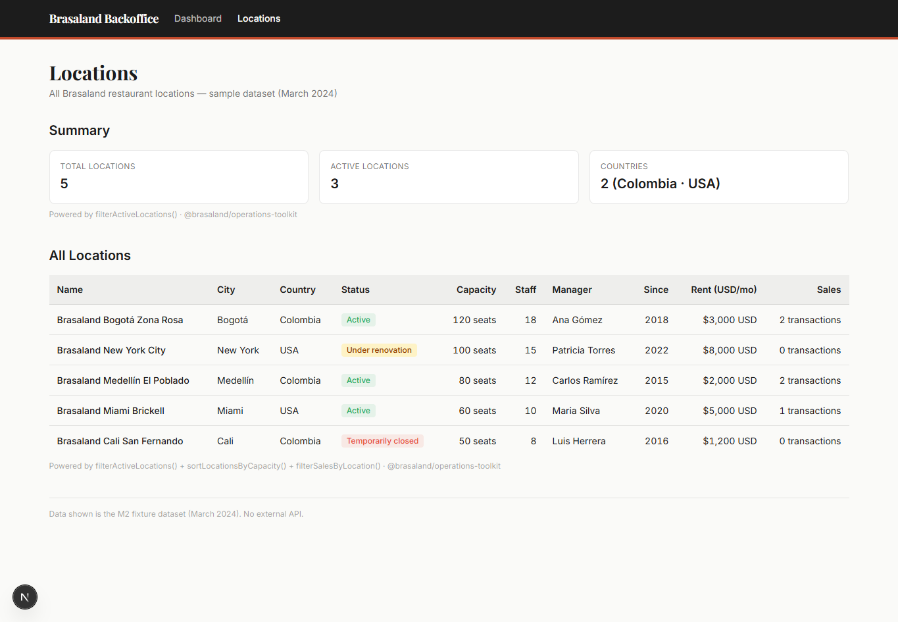

# Brasaland Backoffice

Internal operations dashboard for Brasaland. The app has two data modes:

- **Dashboard** (`/`) and **Locations** (`/locations`) — M2 fixture data from `@brasaland/operations-toolkit` (no API calls).
- **Inventory** (`/inventory/*`) — live ingredient data from `services/inventory` via Next.js rewrites (no backend CORS changes).

## Setup

Run commands from **`uis/backoffice/`**.

### Environment

Copy `.env.example` to `.env.local`:

```powershell
cd uis/backoffice
copy .env.example .env.local
```

| Variable                        | Purpose                                                        |
| ------------------------------- | -------------------------------------------------------------- |
| `NEXT_PUBLIC_INVENTORY_API_URL` | Same-origin proxy base → `http://localhost:3003/api/inventory` |
| `NEXT_PUBLIC_AUTH_API_URL`      | Same-origin proxy base → `http://localhost:3003/api/auth`      |

Rewrites in `next.config.ts` forward `/api/inventory/*` to `services/inventory` and `/api/auth/*` to `services/auth`. Canonical ports: [../../docs/standards/project-context.md](../../docs/standards/project-context.md#port-assignments).

### Dev server

```powershell
npm run dev
```

Open **http://127.0.0.1:3003**

## Routes

| Path                         | Auth | Description                                                 |
| ---------------------------- | ---- | ----------------------------------------------------------- |
| `/`                          | No   | Operations dashboard (M2 fixtures)                          |
| `/locations`                 | No   | Locations table (M2 fixtures)                               |
| `/login`                     | No   | Sign in (JWT stored in `localStorage`)                      |
| `/register`                  | No   | Create account (`POST /auth/register`); stores access token |
| `/account/profile`           | Yes  | View/edit name, phone, address (`GET`/`PUT /profiles/me`)   |
| `/inventory/products`        | Yes  | Ingredient list with `current_stock`                        |
| `/inventory/orders/inbound`  | Yes  | Log IngredientEntry (supplier delivery)                     |
| `/inventory/orders/outbound` | Yes  | Log IngredientExit (consumption or waste)                   |
| `/inventory/orders`          | Yes  | Read-only order history                                     |

**Auth session behavior:** inventory and reporting API clients attach `Authorization: Bearer` (including inventory GETs). On **401**, they clear `brasaland_access_token` and hard-navigate to `/login`. Login and register failures stay on-page errors (no redirect). Nav **Logout** clears the token and redirects to `/login`.

## Screenshots

Locations table (`/locations`) with M2 fixture data:



## Manual test flow

1. Start auth: `cd services/auth && uv run uvicorn app:app --port 8002`
2. Start inventory: `cd services/inventory && uv run uvicorn app:app --port 8012`
3. Seed inventory (once): `cd services/inventory && uv run python seed.py`
4. Register at backoffice `/register` or use an existing user on auth (port 8002 `/docs` if needed)
5. `cd uis/backoffice && npm run dev`
6. Open `/login` → sign in → redirected to `/inventory/products`
7. Verify seeded ingredients and `current_stock`
8. Log an **inbound** order from `/inventory/orders/inbound`
9. Log an **outbound** order from `/inventory/orders/outbound` (try exceeding stock to see API error message)
10. Open `/inventory/orders` — merged history with Inbound/Outbound badges
11. Open `/account/profile` — update name/phone/address; use **Logout** in the nav to clear the session

## API client

All inventory HTTP calls go through **`lib/inventory.ts`** (Bearer on reads and writes; shared 401 → `/login`). Auth helpers live in **`lib/auth.ts`** (`login`, `register`, `logout`). Profile calls go through **`lib/profile.ts`**. Components must not call `fetch` directly.

## Telemetry

All telemetry HTTP calls go through **`lib/telemetry.ts`** via `track(eventType, properties)`. Set `NEXT_PUBLIC_TELEMETRY_ENDPOINT` in `.env.local` (see `.env.example`); the Next.js rewrite forwards `/api/telemetry/*` to `services/telemetry`. Canonical ports: [../../docs/standards/project-context.md](../../docs/standards/project-context.md#port-assignments).

Copy `.env.example` to `.env.local` before running locally:

```powershell
cd uis/backoffice
copy .env.example .env.local
```

Phase 1 events emitted from the backoffice UI:

| Event                       | Trigger                                              |
| --------------------------- | ---------------------------------------------------- |
| `user_login_succeeded`      | Successful login with location selected              |
| `user_login_failed`         | Failed login (60s burst aggregation)                 |
| `session_expired`           | Missing or expired JWT on guarded routes             |
| `ingredient_list_viewed`    | Products list loads successfully                     |
| `supply_order_created`      | Inbound order submitted successfully                 |
| `supply_order_failed`       | Inbound order rejected                               |
| `consumption_order_created` | Outbound order submitted successfully                |
| `consumption_order_failed`  | Outbound order rejected                              |
| `order_form_abandoned`      | Order form idle 30s after interaction without submit |

`supply_order_created` currently emits `supplier_id: 0` because the inventory API uses `supplier_name` only (telemetry plan §8 gap — no supplier directory id yet).

Manual test: start telemetry with `cd services/telemetry && uv run uvicorn app:app --port 8013` alongside auth and inventory.

## Testing

From the monorepo root:

```bash
npm run test --workspace @brasaland/backoffice
```

Expect **30** passed.

Vitest unit tests cover `lib/api-error.ts`, `lib/inventory.ts`, `lib/stock-level.ts`, `lib/telemetry.ts`, `lib/locations.ts`, and `lib/login-failure-aggregation.ts`.

```powershell
npm run build
```

## Architecture note

Browser requests hit the Next.js dev server on port 3003, which rewrites to the Python services. This avoids adding CORS middleware to `services/inventory` or `services/auth`.

## Production slice

`uis/start.sh` is local three-`next dev` only — do not use it in production. The image [`Dockerfile`](./Dockerfile) runs `next start -p 3003` as the `node` user. Browser API bases default to relative `/api/auth` and `/api/rfp` when `NEXT_PUBLIC_*` is unset. `NEXT_PUBLIC_SLICE_NAV=1` (baked in the image) shows Dashboard, Locations, RFP, Profile only. Runbook: [../../docs/deploy/rfp-slice.md](../../docs/deploy/rfp-slice.md).
